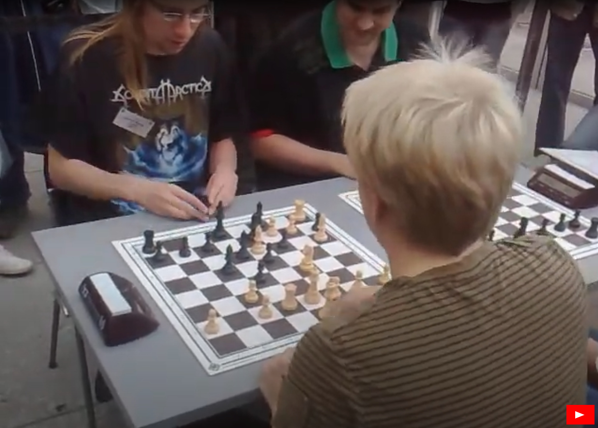
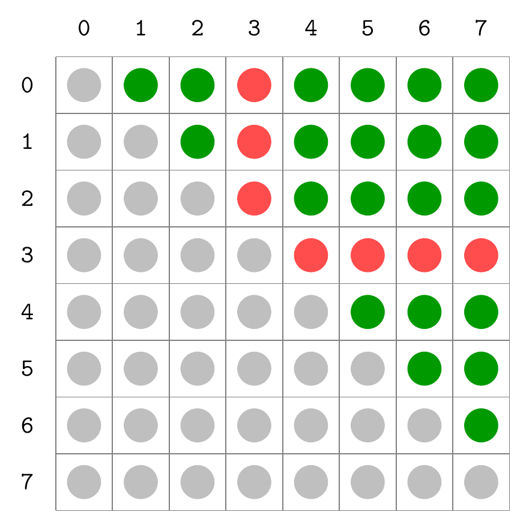
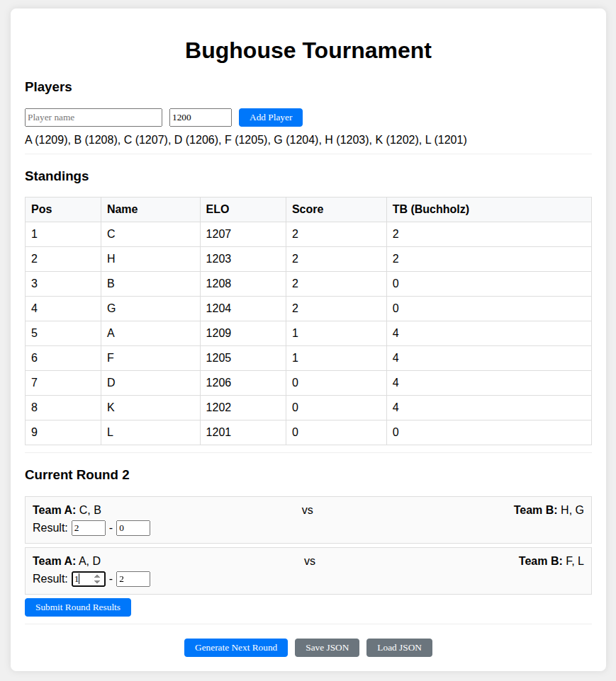

# Google OR-Tools: жеребкування турніру по шведкам

Нещодавно у мене виникла практична задача, яку я вирішив за допомогою агента Gemini Code та бібліотеки OR-Tools.
Я вирішив цей свій досвід описати у статті.
Вона може бути корисна щоб побачити як виглядає клас задач, які розв'язує OR-Tools.
І, коли виникне щось подібне, ви зможете розпізнати паттерн та використати цей інструмент замість власного велосіпеду.
Також поділюся враженнями від роботи з LLM, можливо це теж комусь буде цікаво.

## Шведки

Є така цікава гра як шведські шахи.
Як видно з назви, це варіант шахів, але не один на один, а два на два.
Особливість в тому, що коли твій партнер з'їдає фігуру на своїй дошці, він передає її тобі.
В свій хід ти можеш поставити цю фігуру на свою дошку майже будь-куди.
Мат на будь-якій дошці це перемога команди.

Це дуже цікава, весела, швидка та динамічна гра.
Треба постійно спілкуватися з партнером: «дай коня», «тільки не ферзь», бо часто виставлення потрібної фігури вирішує долю партії.
В цю гру люблять грати як початківці, так і професіонали.
Можете подивитися як це виглядає у реалі (четверта партія фінального матчу, Берлін, 2009):

[](https://www.youtube.com/watch?v=mMxERRP7R3g)

Іноді ми збираємося в нашому шаховому клубі щоб пограти в шведки.
Але... є певні проблеми.
Робити сталі пари... приходиться, бо що робити?
Але тут дуже багато недоліків: грати цілий день в парі з новачком ще той квест.
Сильні хочуть грати з сильними проти сильних, але гравців не так щоб багато.
Ще проблема, якщо людей не кратно чотирьом, то хтось не буде грати.

Звісно, що будь-який шахіст відразу почне мріяти про аналог швейцарської системи,
коли в наступному колі гравці паруються згідно з результатами:
лідери проти лідерів, середняки проти середняків.
Проте готових таких програм я не знайшов.
Але я ж програміст!
До того ж є надія на LLM.

## Формалізація задачі

Давайте трохи подумаємо підходи до розв'язку цієї задачі.
Отже, у нас є список учасників.
У нас є попередні результати (та рейтинги).
Треба створити розклад на поточний раунд: хто з ким та проти кого грає.

По суті серед всіх можливих варіантів жеребкування нам треба обрати найкращий.
Як можна вирішити цю задачу?
По-перше, можна намагатися створити алгоритм, який буде будувати потрібне нам жеребкування,
додаючи на кожному кроці пару, яка саме в цей момент оптимальна.
По суті так проводили жеребкування за швейцарською системою люди у добу, коли не було комп'ютерів.
Так, ми можемо зайти в глухий кут, коли всі варіанти будуть погані.
Тоді нам прийдеться відкотитися та розбити попереднє парування.
Це називають жадібний перебор з відкатами, по суті мова йде про кастомну реалізацію,
заточену під конкретну задачу.

Друге рішення більше математичне: за кожен недолік, який ми бачимо в жеребкуванні, будемо нараховувати штраф.
І тоді у нас вже виникає математична задача оптимізації: серед всіх розкладів знайти з мінімальним штрафом.

Оба підходи у чомусь схожі, обидва мають сенс.
Gemini Code на початку обрав перший варіант.
Саме так, наприклад, працює одобрена ФІДЕ голландська система жеребкування швейцарок.
Але це гарно працює, коли система штрафів стала.
Якщо брати R&D, саме те що маємо, то досить неочевидно які штрафи дадуть добрий результат.
Будь які експерименти зі штрафами це переробка алгоритму перебору, що може бути накладно.
Тому всі спроби LLM піти саме цим шляхом були рішуче заблоковані, я поставив дуже вузьке питання:
що це за математична задача, які є методи розв'язку, які бібліотеки Python існують.
І серед описаних варіантів я знайшов те, що мене зацікавило: OR-Tools.

Що таке OR-Tools?
Це пакет для вирішення задач псевдобулевої оптимізації (pseudo-Boolean optimization).
Маємо булеві змінні (звичайні біти).
Маємо обмеження на них, тобто якісь комбінації бітів дозволені, якісь заборонені.
І маємо функцію, яка оцінює кожен дозволений варіант, її називають цільовою функцією.
Солвер знаходить саме таку комбінацію бітів, яка дозволена та дає найкраще значення цільової функції.

## Реалізація

Таким чином нам треба лише знайти шлях, як закодувати жеребкування послідовністю бітів.
Після цього усе стає простіше: ми просто граємося штрафами та оцінюємо результати жеребкування.
Жодних змін в алгоритмі!

Отже, як саме закодувати бітами жеребкування?
Саме це питання я задав LLM після того, як зрозумів основи OR-Tools.
Вона з задачею справилася, але справилася неоптимально.
Ітак, по-перше, нам треба задати пари гравців, які грають в одній команді.
Припустимо, що у нас 8 гравців.
Створити одну пару можна C(8, 2) = 28 різними способами.
Тому у нас буде 28 бітів, кожен з яких буде відповідати кожній парі.
Графічно це можна відобразити як таблицю або матрицю, де нас цікавлять лише елементи над діагоналлю.



Звісно, що ми не можемо встановити всі 28 бітів в одиницю.
У кожного гравця має бути лише один напарник.
Це означає, що якщо взяти всі можливі пари для одного гравця, то там може бути встановлений лише один біт.
На малюнку сірим показані недоступні позиції (діагональ і нижче), зеленим - можливі пари гравців, червоним - всі можливі пари для гравця 3.
Рівно один з червоних бітів має бути встановлений в одиницю.

З опонентами все так само, тільки треба щоб для кожного гравця було встановлено рівно два біти.
Ще треба додати умову, що партнер не може бути противником.
Це досягається за допомогою умови: «якщо два гравці є партнерами, то біт їхнього протистояння має бути скинутий».
Нарешті, останнє обмеження: якщо два гравці партнери, то їхні опоненти мають співпадати.
Інакше може вийти ситуація, коли гравець A грає з партнером B проти гравців C і D, а гравець B чомусь грає проти E і F.
Це все, лишилося лише подивитися, як це виглядає мовою OR-Tools:

```python
model = cp_model.CpModel()
is_team, is_opp = {}, {}

for i, j in pairs(range(qactive), 2):
    teamvar = model.NewBoolVar(f't_{i}_{j}')
    oppvar = model.NewBoolVar(f'o_{i}_{j}')
    is_team[i, j] = teamvar
    is_team[j, i] = teamvar
    is_opp[i, j] = oppvar
    is_opp[j, i] = oppvar
    model.Add(teamvar + oppvar <= 1)
```

Давайте трохи розберемо цей код.
`cp_model.CpModel()` це створення моделі або задачі, яку ми будемо розв'язувати.
`is_team` та `is_opp` словники, це булеві змінні, які відповідають за індікацію того, хто є партнери, а хто суперники.
Ключ це пара індексів `(i, j)`, де `i` та `j` це індекси гравців від 0 до `qactive-1` (`qactive` — кількість гравців).
Щоб не турбуватися порядком індексів, додамо відразу два елементи у словник.

Також ми додаємо умову, що партнер не може бути суперником.
Це робиться за допомогою рядка `model.Add(teamvar + oppvar <= 1)`
Часто в математиці біти це не значення `True` чи `False`, біти це цілі значення `0` або `1`.
Тому їх можна розглядати як цілі числа.
Саме тут ми і робимо, коли пишемо умову `teamvar + oppvar <= 1`.
Очевидно, ця умова може бути порушена, лише коли обидві змінні `teamvar` та `oppvar` встановлені в одиницю.
Тобто партнер не може бути суперником.

Ще слід зазначити, що часто, коли бачиш `teamvar + oppvar` ти підсвідомо очікуєш, що тут буде виконано обчислення.
У цьому випадку це не так.
`teamvar` та `oppvar` мають тип змінної моделі OR-Tools, для якої перевизначена операція `__add__`,
тому `teamvar + oppvar` формує вираз, для якого також перевизначена операція `__le__`.
Таким чином жодних дій виконано не буде, буде побудовано дерево, яке й буде передано у метод model.Add.
Це схоже на те, як працюють бібліотеки типу NumPy або SymPy:
замість того щоб відразу обчислювати результат, вони будують граф обчислень,
який потім можна оптимізувати і виконати.

```python
for i in range(qactive):
    model.AddExactlyOne([is_team[i, j] for j in range(qactive) if i != j])
    model.Add(sum(is_opp[i, j] for j in range(qactive) if i != j) == 2)
```

Далі доволі очевидні умови, що має бути лише один партнер та двоє суперників.
Щоб проілюструвати різні методи додавання обмежень, використано як `AddExactlyOne`
(має бути рівно один з перерахованих бітів),
так і знайомий нам `Add` який використовує вбудований `sum` який викличе перевантажений метод `__add__` для змінних,
перевантажений метод `__eq__` для виразу та константи.

```python
for i, j in pairs(range(qactive), 2):
    for k in range(qactive):
        if k == i or k == j:
            continue
        model.Add(is_opp[i, k] == is_opp[j, k]).OnlyEnforceIf(is_team[i, j])
```

І нарешті умова яка зв'язує всіх учасників за одним столом.
Читати тут краще з кінця: якщо гравці `i` та `j` партнери, то гравець `k` має бути або суперником для обох, або ні.
Думаю, це достатньо ілюстративно щоб зрозуміти як працює `OnlyEnforceIf`:
умова застосовується лише коли встановлена змінна.

**Вправа для читача:** створіть 64 булеві змінні для шахівниці 8×8 та запишіть умови для розташування восьми ферзів, щоб вони не били одне одного.
Подумайте як реалізувати обмеження: на кожній горизонталі рівно один ферзь, на кожній вертикалі рівно один ферзь, на кожній діагоналі максимум один ферзь.

Gemini в принципі задачу розв'язала, але... неоптимально.
Окрім змінних партнерства та суперництва, вона створила додаткову сутність — стіл.
У нас додатково з'явилися змінні «гравець _i_ сидить за столом _k_».
І це дуже великий удар по швидкодії.
Навіть якщо не брати до уваги кількість змінних, у нас з'явилося досить багато симетрій,
бо як гравців за столами не розсаджуй, це суттєво нічого не змінить.
Але для алгоритму це може бути жахіттям, бо багато варіантів будуть мати майже однакові значення штрафів.

Але, на коментар «Ти здуріла?» Gemini швидко виправила помилку.

Йдемо далі, наступним кроком буде оцінка розташувань.
Це виконує наступний код:

```python
obj_terms = []
for i, j in pairs(range(qactive), 2):
    p1, p2 = squad[i], squad[j]
    t_cost = sum(w * f(p1, p2, stats, groups) for w, f in team_fines)
    o_cost = sum(w * f(p1, p2, stats, groups) for w, f in opp_fines)
    obj_terms.append(is_team[i, j] * int(t_cost))
    obj_terms.append(is_opp[i, j] * int(o_cost))

model.Minimize(sum(obj_terms))
```

Як бачимо цей код доволі простий:
для кожної пари гравців ми задаємо штраф, наскільки небажано спарувати їх як партнерів та як противників.
`t_cost` показує, наскільки небажано, щоб гравці _i_ та _j_ грали в одній парі.
Відповідно `o_cost` показує, наскільки небажано щоб гравці _i_ та _j_ були суперниками.
Це залежить від історії (як вони раніше перетиналися), від результатів (пам'ятаємо, що лідери мають грати проти лідерів).
Це все закодовано у стані, який описується в змінних `squad` (список активних гравців), `stats` (їхня статистика), `groups` (групи по очках).

`is_team[i, j] * int(t_cost)` — знову бачимо перевантажений оператор: якщо біт встановлений, пригадуємо, що математично це один, то додаємо штраф.
Якщо нуль, то нуль помножений на штраф зануляє штраф.

Штрафи це найбільш прикладна частина, вона вимагає розуміння домену.
Саме вони керують процесом жеребкування.
Я знайшов, що така система дає досить непогані результати:

```python
def deny_same_partner(p1, p2, stats, groups):
    return 1 if p2 in stats[p1].partners else 0

def deny_same_opp(p1, p2, stats, groups):
    return stats[p1].opps.count(p2)

def pts_mismatch(p1, p2, stats, groups):
    return abs(stats[p1].points - stats[p2].points)

def team_same_points_pattern(p1, p2, stats, groups):
    s1, s2 = stats[p1], stats[p2]
    if s1.points != s2.points:
        return 0
    group = groups[s1.points]
    n, d = len(group), abs(group.index(p1) - group.index(p2))
    return abs(d - n / 2.0)

def opp_same_points_pattern(p1, p2, stats, groups):
    s1, s2 = stats[p1], stats[p2]
    if s1.points != s2.points:
        return 0
    group = groups[s1.points]
    n, d = len(group), abs(group.index(p1) - group.index(p2))
    return min(abs(d - n / 4.0), abs(d - 3.0 * n / 4.0))

team_fines = [
    (1000000, deny_same_partner),
    (   1000, pts_mismatch),
    (      1, team_same_points_pattern),
]

opp_fines = [
    (1000, deny_same_opp),
    (1000, pts_mismatch),
    (   1, opp_same_points_pattern),
]
```

`deny_same_partner` це заборона гравцям грати в одній парі, якщо вони вже грали.
Заборона бо вага 1000000.
Так, можна було заборонити на рівні структури, але... якщо 8 гравців вирішать зіграти турнір в 10 турів, то... чому й ні?
Не знаю, як це буде виглядати, але після семи турів будуть повтори.

Далі йдуть три штрафи з однаковим ваговим коєфіцієнтом 1000.

Перший це `deny_same_opp`, хочемо не парувати однакових суперників.
Як бачимо, ми досить толерантно ставимося до повторів суперників.
По-перше, їх у два рази більше ніж партнерів.
По-друге, для 8 гравців у нас вже в четвертому турі була б вимушена розсадка хто лишився.
Але це питання смаку.

Другий штраф це `pts_mismatch`, працює і для партнерів, і для суперників.
Хочемо щоб у парі та у протистоянні була приблизно однакова кількість очок.

Останній штраф це `opp_same_points_pattern` та `team_same_points_pattern`.
Це паттерн розсадки гравців в одній очковій групі.

Навіщо? Якщо розсаджувати випадково, лідери можуть почати грати проти лідерів з першого туру.
Це створює багато рандому.
Якщо робити рівні пари (1 vs 2, 3 vs 4), то після першого туру розташування буде випадковим.

А ми хочемо, щоб сильні гравці йшли наверх.
Тому використовується певний шаблон.
Наприклад, для 16 гравців з відомими рейтингами в першому турі алгоритм видасть:
1+9 vs 5+13, 2+10 vs 6+14, 3+11 vs 7+15, 4+12 vs 8+16.
Тобто сильніші гравці матимуть більше шансів виграти, хоча всяке трапляється.

Цікаво, що саме в прикладній частині Gemini дуже сильно тупувала.
Її збивали з пантелику шахи, вона намагалася пригняти аналогії звідти.
Вона паттерну розсадки хотіла втюхати вагу 1000 за компанію, що повний ідіотизм.
Причому, якщо людина розуміє, що в темі вона не розбирається, то поводиться скромно, задає питання, то Gemini...
Просто була прикладом войовничого невігластва.
Так, це зрозуміло, шведки це не те, чим забитий інтернет.
Але цікавий момент, який варто мати на увазі: коли йдеш за межі мейнстрімних тем, LLM може видавати дуже впевнені, але абсолютно неправильні поради.

Останній крок це запуск пошуку.
Для цього нам треба просто створити Solver та запустити його:

```python
solver = cp_model.CpSolver()
solver.parameters.max_time_in_seconds = 20.0
status = solver.Solve(model)
```

Тут ми встановлюємо максимальний час виконання 20 секунд.
Якщо солвер не знайде оптимального розв'язку за цей час, він поверне найкращий знайдений варіант.
Для складних задач це важливо, бо інакше пошук може тривати дуже довго.

Тепер отримуємо та друкуємо результат:

```python
if status in (cp_model.OPTIMAL, cp_model.FEASIBLE):
    for i, j in pairs(range(qactive), 2):
        team_value = solver.Value(is_team[i, j])
        opp_value = solver.Value(is_opp[i, j])
        print('Pair', i, j, '->', team_value, opp_value)
```

Солвер може повернути різні статуси:
`OPTIMAL` означає що знайдено оптимальний розв'язок, найкращий можливий.
`FEASIBLE` означає що знайдено допустимий розв'язок, але не обов'язково найкращий, зазвичай це відбувається коли час вичерпано.
В обох випадках ми маємо робочий розв'язок і можемо його використовувати.

**Вправа:** закінчити приклад про 8 ферзів, та надрукувати одне розташування.

**Вправа:** використовуючи callback клас (успадкувавши від `cp_model.CpSolverSolutionCallback`) та параметр `solver.parameters.enumerate_all_solutions = True`, отримати всі розташування ферзів.

## Ресурси

Звісно що проводити турнір з командного рядку для більшості буде незручно.
Тому треба інтерфейс.
Шкода, що я в цьому не спец.
Але, о чудо! Тільки я описав що я хочу, як Gemini миттєво видала потрібний працюючий код, рівно так як я просив.
Працює й добре, я в цьому не розбираюся.

Повний код доступний на GitHub: [mustitz/bughouse-swiss](https://github.com/mustitz/bughouse-swiss)

Там окрім жеребкування багато допоміжного коду, відладка, симуляції, тощо.

Готовий сайт можна подивитися тут: [bughouse-swiss demo](http://mustitz.host.funtoo.org:5001/)



## Підсумки

Час зробити підсумок.

Головна користь, як на мене, полягає у тому, що ви будете знати про наявність OR-Tools.
І якщо виникне схожа задача (комбінаторна оптимізація з обмеженнями), то будете розуміти куди копати.
Ми побачили як формулювати задачу через булеві змінні та обмеження.
Як задавати штрафи для м'яких умов.

Також я трохи розважив вас байками про LLM.
