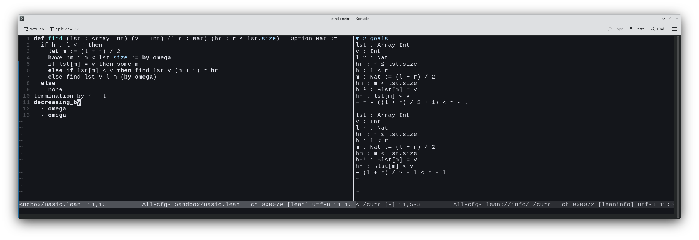

# The Curry-Howard Isomorphism

The world got a bit noisy recently around the Navier-Stokes problem.
A ton of videos came out explaining to a general audience what exactly got solved.
I'm not a PDE expert, so it's hard for me to judge how honest those videos are: where they simplify to the point of swapping concepts, and where they just quietly skip the inconvenient details.
I'm a programmer, so what caught my attention instead was Lean 4, since a proof there is a program written in that programming language.
I'll guess that a lot of developers here will say to themselves: "What is this nonsense!"
Well, I happen to know a bit about this, so I decided to explain on my fingers how this can be.

The Curry-Howard isomorphism is a statement that you can build a correspondence between mathematical statements and function declarations in a programming language,
and between proofs and function implementations.
Sounds weird, let me try to explain with an example.
Let's look at a function in Go

```go
func modusPonens(a A, f func(A) B) B
```

we can pretty easily figure out how to implement it in a way that satisfies the compiler

```go
func modusPonens(a A, f func(A) B) B {
    return f(a)
}
```

But suppose we have another function:
```go
func nonsense(a A, f func(B) A) B
```

How can we implement this one?
Sure, in most programming languages we have plenty of tricks for this.
We could return `null`, we could somehow construct an object, we could force a type cast.
But if we forbid all these tricks, it's fairly easy to convince yourself that the body of this function cannot be written.

Why?
The first function is an encoded logical formula: `(A ∧ (A → B)) → B`.
This formula even has its own name, modus ponens, from Latin, roughly "the method that affirms."
This syllogism has been known since antiquity, though the Latin name showed up much later.
If A → B is implication, we can build a truth table

| A | B | A → B | A ∧ (A → B) | (A ∧ (A → B)) → B |
|---|---|--------|--------------|----------------------|
| 𝔣 | 𝔣 | 𝔱      | 𝔣            | 𝔱                    |
| 𝔣 | 𝔱 | 𝔱      | 𝔣            | 𝔱                    |
| 𝔱 | 𝔣 | 𝔣      | 𝔣            | 𝔱                    |
| 𝔱 | 𝔱 | 𝔱      | 𝔱            | 𝔱                    |

We see that the function produces 𝔱 on output regardless of the values of A and B.
Such statements are called tautologies.

In mathematics, formulas that are always true are exactly what we call theorems.
So a theorem isn't just a nice-sounding statement, it's something that can be proven, relying on axioms and inference rules.

If we look at the function `nonsense`, we get (A ∧ (B → A)) → B

| A | B | B → A | A ∧ (B → A) | (A ∧ (B → A)) → B |
|---|---|--------|--------------|----------------------|
| 𝔣 | 𝔣 | 𝔱      | 𝔣            | 𝔱                    |
| 𝔣 | 𝔱 | 𝔣      | 𝔣            | 𝔱                    |
| 𝔱 | 𝔣 | 𝔱      | 𝔱            | 𝔣                    |
| 𝔱 | 𝔱 | 𝔱      | 𝔱            | 𝔱                    |

We see that at A = 𝔱, B = 𝔣 the formula is false.
So it's not a tautology, which means it's not a theorem, and that's why the body of `nonsense` can't be written (without tricks).

Here you can already see the beginning of the idea: if you can write the body of a function, the statement it encodes is true.

## Programming languages with dependent types

The next question is obvious: can we come up with a programming language that is, in some sense, equivalent to mathematics?
Clearly C, Java, Go and similar languages hit an expressiveness wall very quickly: even plain `¬` for an arbitrary statement already causes problems.
So they simply won't do.
Yes, I think most people have already guessed that such a programming language is Lean 4.
But it's still not that simple.

First, the programming language must not contain tricks that let you write the body of any function.
It turns out that purely functional typed programming languages fit the bill, meaning ones without variables.
Next, there's another condition: totality of functions.
That's definiteness, the compiler has to check that there are no exceptions in the code and that every case is handled,
and finiteness, meaning the compiler has to check that the function will eventually terminate.

And this is where it gets interesting.
A lot of people have heard that the halting problem for a Turing machine is undecidable.
So does that mean the compiler has to check an undecidable problem?
How is that even possible?

The answer is simple: the language shouldn't be Turing-complete.
Wait, how so? Some brainfuck is Turing-complete, and this...?
The trick is that you can weaken the programming language so that it's not Turing-complete,
while still being able to solve plenty of practical tasks with it.
This trick is called structural recursion.
We'll talk about it a bit later.

Third, there are dependent types.
Another concept you don't often run into in fastfood languages[^1].
Again, we'll need to explain this one later.

## Structural recursion

Let's try to explain this on our fingers.
All pure programming languages have no variables.
That is, a value is created once, forever.
For example, a list can be constructed in two ways: either make an empty one, or build one from a head element and a tail.
At the same time, the compiler has to make sure we can't build infinite structures like `ones = 1 : ones` in lazy Haskell.
Beyond that it's simple: the compiler checks recursive calls and tries to find an argument
where we're passing a piece of the value that came into the function.
A bit confusing, let's take a look:

```python
def mylen(lst):
  if lst == []:
      return 0
  head, *tail = lst
  return 1 + mylen(tail)
```

In this code you can see that the recursive call to `mylen` happens over a part of `lst`,
it keeps shrinking, so infinite recursion can never happen.
But if you write it like this

```python
def find(lst, value, i):
    if i >= len(lst):
        return None
    if lst[i] == value:
        return i
    return find(lst, value, i+1)
```

then, even though the method is guaranteed to terminate, the compiler can't verify that.
Here `lst` is passed unchanged, the first two arguments don't shrink structurally, and the third one even grows.
The fix? Rewrite the algorithm so the compiler can see it:

```python
def find_proved(lst, value, i):
    if not lst:
        return None
    head, *tail = lst
    if head == value:
        return i
    return find_proved(tail, value, i+1)
```

A separate question is what to do when termination isn't quite so obvious. Like binary search.
Well... then you either need to add such an argument, or poke the compiler's nose at it and write a proof that it's really true.
For example, binary search in Lean might look roughly like this:


```lean
def find (lst : Array Int) (v : Int) (l r : Nat) (hr : r ≤ lst.size) : Option Nat :=
  if h : l < r then
    let m := (l + r) / 2
    have hm : m < lst.size := by omega
    if lst[m] = v then some m
    else if lst[m] < v then find lst v (m + 1) r hr
    else find lst v l m (by omega)
  else
    none
termination_by r - l
decreasing_by
  · omega
  · omega
```

I think if you squint a little, you can recognize the code for binary search.
Yes, this is ML notation, familiar to Haskellers and other functional folks, where function arguments are separated by spaces, which looks unusual to everyone else.
Instead of the familiar `find(lst, v, l, m, by omega)` we see `find lst v l m (by omega)`.
But once you get used to it, it's almost one-to-one with the following code

```python
def find(lst, v, l, r, _):
  if l < r:
    m = (l + r) // 2
    if lst[m] == v:
      return m
    elif lst[m] < v:
      return find(lst, v, m+1, r, _)
    else:
      return find(lst, v, l, m, _)
```

What's different about the Lean code?
First, the type names.
`Array Int` is an array of integers, `Int` is an integer, `Nat` is a natural number,
and here zero counts as natural, unlike what I was taught in school.
The interesting one is last: `hr : r ≤ lst.size`.
The function requires, as its last argument, a proof that `r` is no greater than the number of elements in the array.

Once we're inside the function, we additionally have access to the proven fact `hr`.
Sadly you can't do that in Python, hence the underscore.
The function returns `Option Nat`, a natural number or `none`, a marker for absence of a result,
a type already familiar to many, borrowed from pure functional programming.

Now let's read the function.
Compared to Python, the `if` gained a `h :` prefix before the condition.
Just like `hr`, this is the name of a fact.
Since we've checked the condition, inside the if/true branch it becomes a proven fact `h`, which we might want to use later.

Next, `let` gives a name to a value.

Next, `have`. This is the analog of `assert`...
I'm claiming that the value `m` must be strictly less than the length of the array.
After `:=` there has to be a proof.
`by omega` means I'm too lazy to write it myself, so I'm asking omega to find it for me.
Omega is a solver that looks for proofs of trivial (and not so trivial) arithmetic statements.
Works for me.

Next comes perfectly ordinary algorithmic code, except in the recursive call we need to insert proofs of facts.
In the first case we already have the proof, it's `hr`, since nothing changed.
In the second, `by omega` again, another request to the solver to do our job for us.

Next... remember I said we need an argument that shrinks?
Here it is, just written separately: `termination_by r - l`.
The counter doesn't have to thread through every call and clutter the signature,
we simply state our intent by naming the quantity that decreases.

But naming it isn't enough, the compiler doesn't take our word for it, it needs a proof that it really does decrease.
There are two recursive calls, so there are two proofs.



This screenshot shows vim, where you can see a typical Lean workflow.
The cursor is sitting on the identifier `decreasing_by`, and the LSP shows us which proofs need to be written right now.
That's two goals, one for each recursive call.
It also shows a lot of facts already known to the compiler at this point,
among which you can find the argument `hr`, and the two facts `h` and `hm` that we added and proved ourselves.

That's it, binary search is done, and we've proven both that there's no out-of-bounds access and that there's no infinite loop.

## Dependent types

Time to move to another unique feature of dependently typed programming languages,
so unique it even made it into the name.
Structural recursion is a restriction on proofs, if you removed it, you could easily prove
any statement, that `2+2=5`, that `True=False`, and so on.
Dependent types, on the other hand, add expressiveness to the language, letting you formulate any mathematical statement at all.
So what is it?

A dependent type is a language feature where the types of later arguments in a function can depend on earlier ones.
And it's genuinely hard to find analogs even in mainstream languages.
It somewhat resembles templates in C++, for example

```cpp
template<typename T>
T iif(bool cond, T value1, T value2)
{
    return cond ? value1 : value2;
}
```

Here the function `iif` effectively takes 4 parameters: the type `T`, the condition `cond`, and the values `value1` and `value2`.
Dependent types are a somewhat broader concept, because in C++ the template parameter lives exclusively at compile time,
which is common, but not required, in dependently typed programming languages.
Yes, you can write a `printf` function with parameter type checking done at compile time, meaning

```c
    printf("Value: %d", 42);
```

will compile, while

```c
    printf("My answer: %s", 42);
```

will fail to compile. This is something modern C/C++ do only for the built-in formatting function.
Try adding your own function with slightly extended capabilities like `"Today %{date}"` and the compiler won't help you at all.
But here's an example of such a function from the Idris tutorial:

```idris
printf : (fmt : String) -> FormatType (parseFormat fmt)
```

`fmt` is our format string.
`parseFormat` is a function that returns the parsed format as a list.
It can look like this:

```idris
data Format = FInt Format | FString Format | FLit Char Format | FEnd

parseFormat : String -> Format
parseFormat ('%' :: 'd' :: cs) = FInt (parseFormat cs)
parseFormat ('%' :: 's' :: cs) = FString (parseFormat cs)
parseFormat (c :: cs)          = FLit c (parseFormat cs)
parseFormat []                 = FEnd
```

The definition of the `Format` type here is recursive, for the string "%s=%d" it returns
`FString(FLit '=' FInt(FEnd))`

And the real magic is `FormatType`, which turns this sequence into an actual language type:

```idris
FormatType : Format -> Type
FormatType (FInt fmt)    = Int -> FormatType fmt
FormatType (FString fmt) = String -> FormatType fmt
FormatType (FLit _ fmt)  = FormatType fmt
FormatType FEnd          = String
```

For our example we get the following chain of transformations:

```
FormatType (FString(FLit '=' FInt(FEnd)))
String -> FormatType (FLit '=' FInt(FEnd))
String -> FormatType (FInt(FEnd))
String -> Int -> FormatType(FEnd)
String -> Int -> String
```

So the type of the expression `printf "%s=%d"` is `String -> Int -> String`,
meaning it's a function that takes a `String` and an `Int` and returns a `String`.

That's all nice, that's all cool, but how is this connected to mathematics?
Let's go back to our example in Lean:

```lean
def find (lst : Array Int) (v : Int) (l r : Nat) (hr : r ≤ lst.size) : Option Nat :=
```

Our arguments here are `lst`, `v`, `l`, `r`, `hr`.
Pay attention to the last argument `hr`, and its type `r ≤ lst.size`.
It's a bit strange to see a conditional expression instead of a type.
Here `≤` isn't a boolean value, it's a type constructor that takes two numbers and returns the type of proofs that the first is no greater than the second.
In Lean it's defined roughly like this:

```lean
inductive Le : Nat → Nat → Prop
  | refl (n : Nat) : Le n n
  | step (n m : Nat) : Le n m → Le n (m + 1)
```

So proving `Le n m` means constructing a value of this type: either `refl n`, when `n = m`,
or `step`, cranking +1 onto the right bound as many times as needed until `refl` can be applied.
So `2 ≤ 4` is a type, and one of its values could be `step 2 3 (step 2 2 (refl 2))`: `refl 2` gives `2 ≤ 2`, the first `step` raises it to `2 ≤ 3`, the second to `2 ≤ 4`.
And `4 ≤ 2` is also a type, just one for which we can't construct any value,
so this is how types become statements, and false statements are exactly those types that have no values.

Back to the definition of `find`.
We see that the earlier arguments `r` and `lst` are precisely what get used to construct the type for the fact
that constrains `r`.

If in functional programming languages functions are first-class citizens,
no different from other values like integers or strings,
then in dependently typed programming languages, types also become first-class.

I didn't plan to dive too deep into this, the concept is complex enough that fully covering it would need its own separate article.
This is only a sketch of the main idea, which, again, gives the language enough expressiveness to write down any mathematical statement.

## Different mathematics

Okay, fine, say we built such a programming language.
Would it be equivalent to mathematics?
This is where it gets interesting.
The first question is, "what even is mathematics?"
Or more precisely, which axiom systems is it built on?

Historically most mathematicians worked in the set-theoretic axiom system called ZFC.
For a long time this was considered the only possible system, period.
Maybe that's why von Neumann tried to come up with a different axiom system, known as NBG (von Neumann-Bernays-Gödel set theory).
And it later turned out his axiom system is equivalent to ZFC.
This reinforced the idea that there's simply no other choice.

But life is unpredictable and interesting, there is a choice!
Research in category theory found out that there's no single "correct" category of sets.
The category of sets given by ZFC is just one example of a broader class of structures, elementary topoi,
where every such topos with a natural numbers object defines its own internal logic and self-contained mathematics.
In plain language, ZFC is a possible choice, but not the only one.
Dependently typed programming languages give us alternative axiom systems.
And yes, I didn't misspeak, there isn't even just two of them.

Depending on the lambda calculus underlying the language, we get different axiom systems.
Lean 4 and Rocq are languages based on the Calculus of Inductive Constructions (CIC).
Agda is Martin-Löf Type Theory (MLTT), intensional flavor.
Cubical Agda is the same, but with cubical type theory, which lets you work with univalence computationally.
There's also Idris, which branched off toward quantity, meaning Quantitative Type Theory (QTT), equivalent to Agda,
but letting you track more precisely what ends up at runtime versus what stays purely at compile time.

But from the point of view of most mathematicians, there's no difference between these axiom systems.
Most practical mathematical results can be proven in all of these systems.
Sure, once you get into ordinals of high rank, nuances do show up,
but that's such an esoteric corner,
so far removed from practical use,
that you can safely forget about it unless you're writing a dissertation on proof theory.

Interestingly, the first attempts to build mathematics on top of dependent types failed.
The problem was that they introduced a type of all types, to which any type belonged, meaning `Type : Type`.
Something like Python's `Type`.
It turned out that the theory then becomes meaningless, because you can prove absolutely any fact in it!
That is, nothing stops you from programming, all the advantages remain, but you can say goodbye to the idea of formalizing mathematics.
It's the same idea as Russell's paradox about the set of all sets,
if it exists, you can build the set of all sets that don't contain themselves and ask, does such a set contain itself?
The barber shaves everyone who doesn't shave themselves.

That's why every programming language today has an indexed hierarchy of types: `Type₁ : Type₂ : Type₃ : ...`.
Each level belongs to the next one, never to itself, so you can't construct `Type : Type` anymore.
This rules out the hack, but... Gödel's theorem says you can't prove consistency from inside the system,
so CIC and MLTT are also a kind of insurance: if one of the systems turns out to be broken, maybe it won't affect the other?

## Intuitionism and the law of excluded middle

There's another interesting point I haven't touched yet.
Mathematics splits into classical and intuitionistic.
The history goes back to Hilbert, who among others formalized the axioms of mathematical logic,
the rock-solid ones, meant to hold always and everywhere.
Among them was the law of excluded middle, A ∨ ¬A.
And indeed, if you build a truth table, this formula is a tautology.

| A | ¬A | A ∨ ¬A |
|---|----|---------|
| 𝔣 | 𝔱  | 𝔱       |
| 𝔱 | 𝔣  | 𝔱       |

But there was a mathematician named Brouwer, who considered this axiom questionable.
This sparked a fascinating exchange, where Hilbert brought up vivid examples,
arguing that forbidding mathematics from using the law of excluded middle is like forbidding boxers from punching with their fists.
And yes, indeed, the law of excluded middle, and proof by contradiction that follows from it, are powerful mathematical techniques.
But the doubt stuck around.

**Theorem**: there exist irrational numbers a, b, such that a^b (a to the power of b) is rational.

**△**
  Assume the irrationality of √2 was already proven by the ancient Greeks.
  Take the number c = √2^√2.

  * If it's rational, the theorem is proven, since a = b = √2 are irrational, and a^b is rational.
  * If c is irrational, then take a = √2^√2, b = √2, then a^b = (√2^√2)^√2 = √2^2 = 2, rational again.
**▲**

Okay, we've proven that there exist irrational numbers a, b such that a^b is rational.
But we haven't found a single concrete pair!
There are two candidate pairs: (√2, √2) and (√2^√2, √2), but which pair actually works, the proof itself doesn't tell us.
In this spirit you can easily build a proof where the choice comes from an infinite set.
So it kind of exists, but there's nowhere to point your finger.

Years passed, the passions cooled down.
Now these are simply two parallel axiom systems.
An intuitionistic proof costs a bit more, since there are more restrictions.
But all the results are useful.
CIC and MLTT are examples of intuitionistic systems.
The corresponding programming languages are too.
Does that mean you can't use them for classical proofs?
No, adding a new axiom is usually as easy as sending two bytes.
You write a function declaration, mark it as an axiom,
which in practice means asking the compiler to just take your word for it that such a function exists.

## Theory and practice

Time for a bit of a summary.
A lot of people might think dependent types are purely theoretical nonsense with no bearing on practice.
I don't think that's true.
Most dependently typed programming languages are Haskell-like languages that let you handle most ordinary business problems just fine.
Yes, a bit quirky in some places.
But for Lean 4 there's an intermediate compilation step to C code, so even in terms of speed it doesn't lose as badly as, say, Python.

And what about Turing completeness?
Well... first, for most practical tasks, like parsing JSON or doing SQL, Turing completeness doesn't matter at all.
Structural recursion is more than enough for that.
Second, every language usually has keywords, analogous to `unsafe` in C# and Rust, that lift the restrictions when writing code.
Such a function can't be used as a proof, but nothing stops you from calling it.
Say, some hypothetical method `run_web_server` won't be total, since we can't guarantee it will ever terminate.
But `handle_request` will be total, here we guarantee that handling a single request will eventually finish.

So which dependently typed programming languages are out there?

First, Lean 4, mentioned many times already.
Very actively developed by a community of mathematicians formalizing lots of proofs.
But the ambition was a full-fledged practical programming language, and the generated code is quite fast too.

Next, Rocq, formerly known as Coq, renamed because of the association with a certain part of male anatomy in English.
It's a dinosaur, originally built for the needs of mathematicians, so it's not very comfortable for programming.
That's why it lives paired with OCaml, also a Haskell-like language in spirit, just outside its ecosystem.
That's no accident: OCaml and Coq grew up side by side in the same lab, INRIA, since the 80s, Coq is even written in OCaml.
This pairing is still alive and working today: programs in OCaml, proofs in Rocq.

Next, Agda, another academic project that runs in a Haskell environment.
Running it requires the GHC runtime (RTS).
On the plus side, that gives you easy interoperability with the mature Haskell ecosystem.
But MLTT makes programming fairly peculiar, you usually end up programming through holes...
It looks like this: first you write a placeholder `?` somewhere, meaning "something needs to go here, not sure what."
Then you can look at the details: what type is expected, and refine it a bit, often through more placeholders.

Last on the list is Idris, a language created not for mathematicians, but more for programmers.
In Idris 2 the main feature is QTT, control over variables.
In mathematics, numbers are conceptually defined as a list of ones: five is `[1, 1, 1, 1, 1]`.
That makes proofs easier to write, but at runtime the speed would drop so much that Python would look like a cheetah by comparison.
For `Nat`, compilers fix this themselves, swapping it for BigInt under the hood, but that's a special case, and dependent types are full of "exists purely for the sake of the proof" things like this.
Idris has a way to mark variables: compile-time only, runtime only, or both, precisely to prevent this problem.

If this topic caught your interest, go google Software Foundations, it's a fantastic set of lectures on the fundamentals, I'm genuinely a fan.
That's the Rocq path.

And, coming back to the topic. The Curry-Howard isomorphism dates back to the late 60s. How exactly was it formulated back when even suitable programming languages didn't yet exist?
The secret is simple, back then it was all about lambda calculus...

[^1]: Not a real term, I made it up. Ever since reading Joel Spolsky's [Big Macs vs. the Naked Chef](https://www.joelonsoftware.com/2001/01/18/big-macs-vs-the-naked-chef/), I've enjoyed calling mainstream languages "fastfood" languages.
