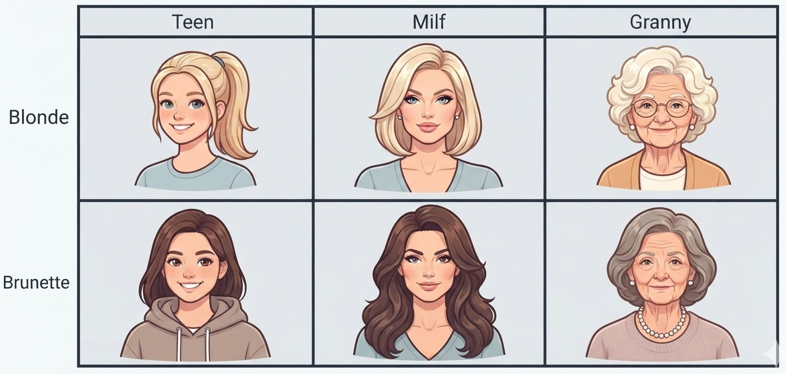
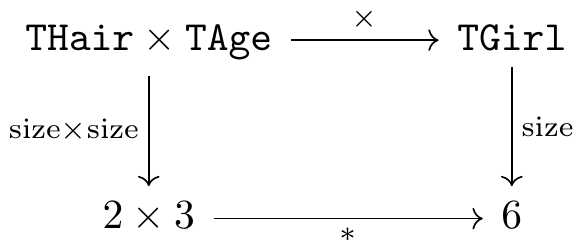
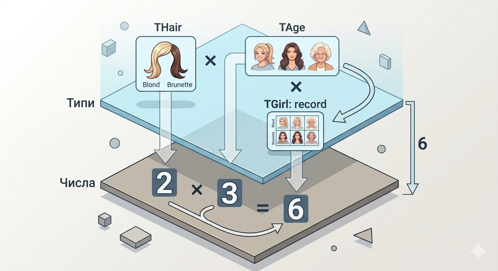
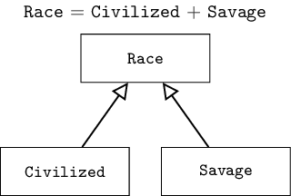

# Алгебраїчні типи даних

Думаю, багато читачів чули про алгебраїчні типи даних (Algebraic Data Types, ADT), знають, що воно живе десь там в Haskell, OCaml, Rust чи Scala, але глибоко в це не занурювалися.
В цій статті я розберу, що це таке, з невеличким акцентом на математиці.


## Типи даних

Спочатку спробуємо розшифрувати назву.
Перше слово «Алгебра».
З'являється воно ще в працях аль-Хорезмі, звідки й пішло інше слово: алгоритм.
Всі пам'ятають, що в школі математика поділялася на алгебру та геометрію.
До алгебри входили ікси, ігреки, багаточлени, графіки, функції, логарифми, тощо.
Але то була алгебра чисел, можливо трохи алгебри багаточленів.
Можна казати про алгебру матриць, тензорів, так й про алгебри об'єктів, непов'язаних з числами, такі як перестановки, строкові рядки, тощо.
Взагалі, математично, алгебра це набір об'єктів та операцій між ними.
Тому алгебра типів це типи та операції між ними.

Добре, але що таке «тип даних»?
Можна без питань визначити, що таке тип даних у конкретній мові програмування, як-то C# чи Python.
Але визначити тип даних у всіх мовах програмування досить важко.
Коли я запитував це питання, то часто чув у відповідь, що це певний контракт,
який визначає, які операції дозволені над даними, а які ні.
Так, це близько, але таке визначення нематематично, тут можна багато дискутувати.

Сурова правда життя лежить у тому, що математично ми можемо дати два визначення.
Перше: тип даних це певна інформація, яка існує лише на етапі компіляції (або будь якої іншої семантичної перевірки коду),
мета якої запобігти певному класу помилок.
Так, можливо ми б й хотіли написати в Java `1 + "test"`, але компілятор нам заборонить.
Це те як типи розглядаються в статично типізованих мовах програмування.
Друге: тип даних це частина значення, але описує інші його частини.
Це те, як типи розглядаються в динамічно типізованих мовах програмування.

Візьмемо Python. З точки зору першого визначення, в мові є лише один тип, а саме `PyObject`.
Звичайні типи даних на кшталт `int`, `string`, або масиви в C# це визначення першого типу.

Треба сказати, що в реальному житті типи стали певними гібрідами.
Навіть в C++ є RTTI, тобто частина типів містить вказівник, який дозволяє нам з'ясувати у runtime структуру нашого типу.
А у Python є анотації типів, які ніяк не впливають на виконання, але допомагають лінтерам.

З точки зору нашої статті, я буду далі говорити про типи лише в розрізі першого визначення,
не уточняючи цього окремо.


## Добуток типів

Ок, що таке типи даних зрозуміло, спробуємо для тренування придумати бодай одну операцію.
Для цього нам знадобляться деякі приклади типів для тренування.
Нехай один містить два значення, інший три.
Тоді перший може може бути

```
type THair = (Blonde, Brunette);
type Hair = "Blonde" | "Brunette";
enum Hair { Blonde, Brunette };
```

а другий:

```
type TAge = (Teen, Milf, Granny);
type Age = "Teen" | "Milf" | "Granny";
enum Age { Teen, Milf, Granny };
```

Наша інтуїція миттєво підказує нам, як з цих двох типів сконструювати третій: просто поєднати їх як поля.
В результаті отримуємо новий тип

```
type TGirl = record hair: THair; age: TAge end;
type Girl = { hair: Hair; age: Age };
struct Girl { hair: Hair, age: Age };
```

Візуалізуємо:



Та подивимося на нього поуважніше...
Ми бачимо, що в результаті у нас тип `Hair` містив два значення, тип `Age` — три, а результат `Girl` містить шість.
`2 * 3 = 6`. Це множення!
Саме тому ця операція над типами називається добутком.
Для нашого прикладу він буде виглядати так:



Тут показано, що нам байдуже, яким шляхом іти від пари типів `Hair` та `Age` в напрямку цифри 6.
Спочатку ми можемо перемножити типи, а потім порахувати розмір результату.
Або можна спочатку порахувати розмір кожного типу окремо, а потім перемножити отримані числа.
Результат буде таким самим.

Таким чином, у нас є ніби-то два поверхи.
На верхньому живуть типи.
На нижньому живуть числа.
В будь який зручний момент ми можемо спуститися з верхнього поверху на нижній, та продовжити нашу подорож так.
Ніяких перешкод на нижньому поверсі при цьому не виникне.




## Сума типів

Тепер ми готові для того, щоб переносити концепції зі світу чисел у світ типів.
Добуток перенесений, не вистачає суми.
Але сума типів `Age` та `Hair` дещо неінтуїтивна, тому придумаємо інший приклад.

Припустимо один тип буде
```
type Civilized = (Elf, Dwarf, Human);
type Civilized = "Elf" | "Dwarf" | "Human";
enum Civilized { Elf, Dwarf, Human };
```

а другий:

```
type Savage = (Orc, Goblin);
type Savage = "Orc" | "Goblin";
enum Savage { Orc, Goblin };
```

Вже тут нам вочевидь, як побудувати суму, новий тип `Race` має містити `2+3=5` різних типів створінь.
Нам лишилося лише визначити це формально.
Та не переплутати з об'єднанням множин.
Ітак, сума двох типів це тег, який показує, з першого чи другого типу буде значення,
та власне два значення, з яких актуальне лише те, на яке вказує тег.


```cs
class TypeSum<T1, T2> {
    enum Tag { First, Second }
    Tag which;
    T1 value1;
    T2 value2;

    public TypeSum(T1 v) { which = Tag.First; value1 = v; }
    public TypeSum(T2 v) { which = Tag.Second; value2 = v; }
}
```

`Race` тоді просто `TypeSum<Civilized, Savage>`.

Саме це є ключова фішка в мовах програмування, які підтримують ADT.
Ось так це записується в різних мовах:

Rust:

```rs
enum Civilized { Elf, Dwarf, Human }
enum Savage { Orc, Goblin }

enum Race {
    FromCivilized(Civilized),
    FromSavage(Savage),
}
```

Haskell:

```haskell
data Civilized = Elf | Dwarf | Human
data Savage = Orc | Goblin

data Race = FromCivilized Civilized
          | FromSavage Savage
```

OCaml:

```ocaml
type civilized = Elf | Dwarf | Human
type savage = Orc | Goblin

type race =
  | FromCivilized of civilized
  | FromSavage of savage
```

Scala:

```scala
enum Civilized { case Elf, Dwarf, Human }
enum Savage { case Orc, Goblin }

enum Race:
  case FromCivilized(value: Civilized)
  case FromSavage(value: Savage)
```

Проникливий читач може помітити тут певний зв'язок між сумою типів та успадкуванням.
Зазвичай в ООП мовах ми почали би будувати нашу ієрархію від базового класу `Race`,
від якого успадковували би `Civilized` та `Savage`.
Відмінність у тому, що компілятор знає геть усі варіанти суми типів, а про нові підкласи він дізнається тільки в момент їх оголошення.




## Возведення у ступінь

Базу ми побудували.
Але спробуємо рухатися далі, та знайти ще цікаві концепції зі світу чисел, які нам стануть у нагоді.
Наступна операція, яка приходить нам в голову, це возведення у ступінь.
Це некомутативна операція, бо `2^3=8` але `3^2=9`.
Що це може бути за звір?
Якщо поміркувати, то можна знайти аналогію й тут: масиви.
Наприклад:

```pascal
type Color = (Red, Green, Blue);
type Value = 0 .. 255;
type RGB = array[Color] of Value
```

Ми бачимо, що `RGB` може містити `256^3 = 16777216` значень, тобто ми побудували тип `Value^Color`.

Тут треба зауважити, що часто в теорії типів, тип `A^B` розглядається як функція B → A.
А масив це лише один зі способів представлення такої функції через таблицю.

## Рекурсія

До цього ми брали у якості прикладів лише типи з обмеженою кількістю значень.
Але навіть простий рядок може приймати нескінченну кількість значень.
Як з цим бути?
Тут нам на допомогу приходить рекурсія!
Візьмемо для прикладу тип `Char` (скажімо, 256 значень) та спробуємо побудувати з нього `String`.
Рядок — це або порожній рядок, або `Char`, за яким йде ще один рядок:

Haskell:

```haskell
data MyString = Nil
              | Cons Char MyString
```

Rust:

```rust
enum MyString {
    Nil,
    Cons(char, Box<MyString>),
}
```

OCaml:

```ocaml
type my_string =
  | Nil
  | Cons of char * my_string
```

Scala:

```scala
enum MyString:
  case Nil
  case Cons(head: Char, tail: MyString)
```

Думаю логіка зрозуміла, рядок це сума типів.
Перший з яких це маркер пустого рядка.
Другий це добуток двох типів: `Char` для поточного символу, та рекурсивного використання `MyString` для решти.

Наприклад, рядок `"abc"` це `Cons('a', Cons('b', Cons('c', Nil)))`.
А пустий рядок це просто `Nil`.

Ще тільки для Rust, щоб компілятор не побудував нескінченний тип, треба `Box`,
це пряма вказівка покласти хвіст рядка в купу, та зберігати лише вказівник.

Але... яке число треба обрати для String?
Це трохи ламає нашу аналогію з числами.
Або потребує трохи більше математичної акуратності.
Нам треба трохи інша структура, а саме натуральні числа з нескінченністю.
Щоб a + ∞ = ∞, a × ∞ = ∞ і так далі.
І така структура є!
Розширені натуральні числа ℕ∞, або можна казати про кардинальні числа ℵ₀,
або навіть про підняті натуральні числа (lifted naturals) ℕ⊥.
Сильно занурюватися в цю тему я не буду, так для педантів.


## Одиниця, або юніт

Йдемо далі.
З операціями розібралися, нескінченістю типів також.
Тепер спробуємо знайти аналоги для конкретних інтересних чисел.
Почнемо з одиниці.
Такому числу буде відповідати тип, який містить лише одне значення.
Що приходить на ум?

Напевно, як аналогія, це `NoneType` з Python.
Так, він містить лише одне значення, а саме `None`.
Зазвичай використовується для функції, аналогом яких зазвичай виступає `void`.
Цікаво, це і є правильний напрямок руху.

`void` це аналог типу, який в мовах, які підтримують ADT, називається юніт (unit).
Це тип містить лише одне значення, яке зазвичай позначають як `()`.
Але `void` це пустота.
Як пустий тип може містити одне значення?
Ну... на мій погляд так, це трохи незручна назва.
Спробуємо зрозуміти логіку.
Щоб повернути аргумент, який містить 8 різних значень, нам треба 3 біти.
Для 4 значень вистачить 2 біти.
Для двох — один.
Для одного — нуль.
Тобто, згідно теорії інформації, одне значення кодується нульом біт!
Трохи незвично, але нічого дивного...
`void` (пустота) означає що ми повертаємо з функції 0 біт інформації, які кодують одне значення.

Ще одна точка зору: припустимо функція повертає завжди нуль.
Тоді немає сенсу нам зберігати це значення у змінну, бо замість цього ми завжди можемо замінити її використання на нуль.
Таким чином, юніт можна використовувати як маркер `void` функцій.


## Нуль

Хтось назвав винахід числа нуль революцією в математиці.
Дійсно, римські числа дещо незграбні.
Але, чи приносить нуль користь в програмуванні?

Припустимо у нас є тип `Void`, справжню пустоту будемо писати з великої літери.
Як в Haskell.
І розглянемо функцію, яка повертає `Void`.
Тобто функція має повернути значення типу, який не має значень.
Щось це мені нагадує...

> Спробуй ти мені добути,\
> Те, чого не може бути,\
> Запиши собі нотатку,\
> Щоб цей квест не позабути.

Так, у фольклорі та комп'ютерних іграх можна знайти рішення.
Але в суворій математиці — ніколи!
Тому така функція ніколи не зможе обчислити значення, яке можна повернути.
Але... ніхто не забороняє їй пробувати це зробити!

Якщо подивитися уважніше, то часто конкретні реалізації C++ мають `__attribute__((noreturn))`.
Тобто є спосіб додатково повідомити компілятор про те, що з цієї функції не буде повернення.
Можна навіть знайти приклади таких функцій: `exit()`, `abort()`, нескінченний цикл контролера, функції, які завжди кидають виняток.
Тобто, навіть в такому екзотичному випадку це може мати сенс!

До речі, в Rust такий тип є, це `!`.
Він довгих десять років жив у нічних білдах, пережив п'ять невдалих спроб стабілізації,
і лише у серпні 2026 його нарешті стабілізували.
Те, що його не зробили правильно відразу, призвело до проблем сумісності:
компілятор роками підставляв замість `!` тип `()`, коли висновок типу ні до чого не був прив'язаний.


## Юніт та воїд в інтерфейсах

Попередній приклад з нульом комусь міг здатися дещо штучним.
Так, згоден.
Але як часто ми у звичайній математиці використовуємо нуль?
Писати `a = b * 0` чи `c = d + 0` досить безглуздо.
Але як часто ми передаємо нуль в якості аргументу?
Це натякає нам, як ще можуть використовуватися типи юніт та воїд на практиці.

Розглянемо інтерфейс

```cs
interface IComputation<In, Out>
{
    void Initialize(In args);
    void RunLongComputationInASeparateThread();
    bool IsFinished();
    Out GetResult();
}
```

Що буде, якщо ми тут будемо передавати наші юніт та воїд?
Функція `Initialize`.
У разі юніт чи очевидно передаємо одне й те саме значення.
Тому... навіщо його передавати взагалі?
Що приводить нас до цікавого правила:
якщо в інтерфейсі в аргументі функції передається юніт, то ми можемо просто видалити цей аргумент.

А якщо `In` це воїд?
Тоді ми взагалі не зможемо ніяк викликати функцію, бо для цього нам прийдеться сконструювати значення яке не існує.
Винятком буде Haskell, бо це лінива мова, тому функцію викликати буде можна, звернутися до цього аргументу не можна.
Але, це друге цікаве правило:
якщо в інтерфейсі в аргументі функції передається воїд, то можна просто видалити цю функцію з інтерфейсу.

У разі `Out` ми вже розглядали.
Повторюся, юніт дасть нам звичайну void функцію
А воїд дасть функцію, яка ніяк не повернеться, а, скажімо, кине виключення `ComputationIsNotFinished`.


## GADT

Щоб ви не думали, що ADT це вершина еволюції, скажу пару слів про розширення ADT,
яке називається Generalized Algebraic Data Types, або GADT.
Вони присутні у Haskell, OCaml, Scala, але відсутні в Rust.
В чому ідея?

Ми можемо написати

```haskell
data Expr = IntLit Int | Plus Expr Expr | Eq Expr Expr
```

Ніби-то все добре, але...
Припустимо, що ми хочемо, щоб компілятор знав не тільки що це вираз, але й якого типу цей вираз.
Тобто він буде параметризуватися: `Expr a`.
Але проблема в тому, що наша сума типів ніяк не може вказати, який саме `a` треба повертати для кожного конструктора окремо.
А от ми це знаємо: `Plus` завжди `Int`, а `Eq` завжди `Bool`.

Тут нам допомагає GADT, який просто дозволяє додатково це вказати:

```haskell
data Expr a where
  IntLit :: Int -> Expr Int
  Plus   :: Expr Int -> Expr Int -> Expr Int
  Eq     :: Expr Int -> Expr Int -> Expr Bool
```

Тоді `eval :: Expr a -> a` пишеться без жодних викрутасів,
його тип буде відомий під час компіляції,
а `Plus (Eq x y) z` просто не скомпілюється.


## Підсумки

Ми пройшли шлях від «це те, що є в Haskell, OCaml, Rust та Scala» до цілої алгебри з `0`, `1`, `+`, `×`, `^`.
І весь цей шлях насправді тримався на одній ідеї,
на морфізмі `size` з алгебри типів в алгебру чисел, який зберігає структуру.
Добуток типів став множенням, сума — додаванням, масив — ступенем, `Void` — нулем, `Unit` — одиницею.

Сподіваюся, ви відчули силу морфізмів, які дозволяють переносити концепції з однієї структури в іншу,
і трохи розширили свій світогляд щодо систем типів.
