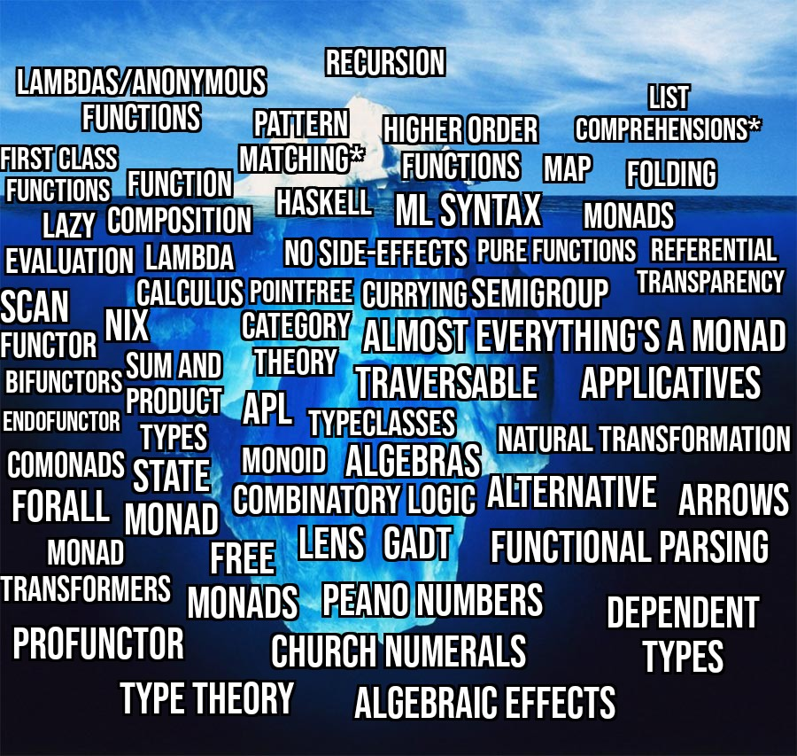

# Монади, Hard Way

## Від автора

Монади.
На форумах я бачив дуже багато обговорень про те, що таке монада.
У них є багато спільного — багато хто не розуміє, що то за звір.
Я теж погано розумію, що це таке, але з задоволенням беру участь у таких дискусіях.
І попри те, що я розумію, що погано розумію, я ще й розумію, що розумію краще, ніж більшість розуміє.
Ну, ви зрозуміли.

Так от, щоб зрозуміти краще, я вирішив написати цю статтю.
Тим більше, що десь ще у 2005 році у мене був вибір: вивчати C# чи Haskell.
Тоді я обрав C#, і зараз схильний вважати це великою помилкою.
C# мені не дав нічого особливого — мова для ширвжитку, купа дрібниць, які не дають тобі іншого бачення світу.
І коли я вже у немолодому віці почав вчити Haskell, то зрозумів, що вся моя кар'єра розробника — це була просто копіпаста монад, хоч я про це й не здогадувався.

Чому “Hard Way”?
Мені одобаються книжки цієї серії.
Є багато розважального контенту, що монади порівнюються з коробками, але...
Це як розповідати про фізику без формул — з'являється хибне уявлення, що ти розумієш.
У книгах серії “Hard Way” занурення у деталі.
Як на мене, лише після того, як ти в деталях розібрався як воно працює, можна казати про розуміння.
От в цій статті ми й будемо занурятися у деталі, розбиратися.

Далі, щоб зрозуміти монади, треба Haskell, Haskell, та ще раз Haskell.
Чому? Відповідь проста — do-нотація.
Так, це лише синтаксичний цукор.
Але, забігаючи трохи наперед, без нього нам довелося б писати лямбду в лямбді в лямбді в лямбді... що перетворило б код на суцільне пекло.
Звісно, do-нотація присутня і в інших мовах, як-от Agda та Idris, але вони все одно близькі родичі Haskell.
Ну... ще PureScript, але він також натхненний Haskell.
Ну... Eta або Frege... що є діалектами Haskell для JVM.
Втім, я підозрюю, що ці мови програмування будуть для читача ще більшою езотерикою, ніж сам Haskell — як пояснювати незрозуміле через щось ще менш зрозуміле.

Якщо ви нічого не знаєте про Haskell, це не страшно.
Я спробую пояснити тонкощі цієї мови, навести аналоги на інших мовах програмування,
таких як C#, коли треба звернути увагу на статичні типи,
або Python, коли буде хотітися від цього сховатися.
По ходу статті я буду все більше та більше розказувати про тонкощі синтаксису Haskell.
Тому якщо ви не знаєте Haskell, то краще поступово читати статтю від початку до кінця, інакше можливий певний ступор.

Але якщо ви не хочете нічого знати про Haskell?
Тоді... у світі є безліч інших цікавих справ:
можна погортати TikTok до четвертої ранку,
навчитися готувати авторські коктейлі і викладати їх в Instagram,
створювати NFT мавпочок, або спостерігати як штучний інтелект забирає вашу роботу.
Вибір за вами!
Але я вважаю досить корисним хоча б ознайомитися з новою мовою програмування, особливо якщо вона містить в собі нові концепції.

Зауважу ще, що майже увесь наведений тут код можна запустити на [godbolt](https://godbolt.org/).
Коли вивчаєш щось нове, то краще не тільки дивитися очами, але й помацати.
На щастя сервіс godbolt дозволяє це зробити, користуючись лише браузером, без встановлення локально компіляторів або IDE.
Тому використовуйте цю нагоду!

## Інтро

Що таке монада?
Я не хочу давати визначення з теорії категорій, яке не має жодного дотику до практичного застосування.
Так, інколи, але нечасто, я буду щось казати у контексті математики та теорії категорій, але це можна сміло пропускати.
Це виключно для цікавості.

На монаду можна дивитися як на інтерфейс, параметризований типом.
Щось на кшталт IEnumerable в C#, тільки набагато корисніший:

```cs
public interface IMonad<T>
{
  /* Some methods */
}
```
Але цього інтерфейсу немає у C#.
Чому?  Чи невже ніхто не додумався його написати?
Принаймні спробувати?
Але, не все так просто.
По-перше, Haskell набагато більш абстрактний, ніж C#.
Інтерфейси там можна параметризувати не тільки типами.
В інтерфейсі IMonad ми очікуємо не просто тип `T`, ми очікуємо тип, який параметризується іншим типом `A`.
В термінології теорії типів він називається «типом вищого порядку» або «типом-конструктором».
Наприклад, ми очікуємо `List`, але не `Int`.
Засобами C# напряму це виразити неможливо.
Існують різні обхідні шляхи імітації такої функціональності, але вони є незграбними та обмеженими.
По-друге, сама мова програмування знає про цей інтерфейс, та додає відповідний синтаксичний цукор навколо нього (do-нотація).

Що ж, ми з'ясували, що монада це інтерфейс, який приймає тип вищого порядку.
Щоб нам було на чому тренуватися, спробуємо створити декілька таких типів, та заодно трохи погратися з ними.
Усі вони будуть мати префікс `My`, щоб не перетинатися з тим, що входить до стандартного модуля Haskell.
Функції мають префікс `my`.
Взагалі, бачине на початку `my` — значить у стандатнії бібліотеці Haskell є те саме без `my`.

Ну що, почали?
Заодно й пройдемо курс адаптації до Haskell.

## Наші кицьки для тренування

### MyMaybe

Розглянемо наш перший тип вищого порядку - `MyMaybe`.
Цей тип представляє значення, яке може існувати або не існувати.
Прямі аналоги цього типу це
[Nullable<T>](https://learn.microsoft.com/en-us/dotnet/api/system.nullable-1?view=net-9.0) у C#,
[Optional<T>](https://docs.oracle.com/javase/8/docs/api/java/util/Optional.html) у Java,
[optional<T>](https://en.cppreference.com/w/cpp/utility/optional) у С++, та
[Option<T>](https://doc.rust-lang.org/std/option/) у Rust.
У Python... там і так кожна змінна може містити `None`.

У Haskell його можна описати як:

```haskell
data MyMaybe a = MyNothing | MyJust a
```

Розберемо покроково це визначення.
Перша лексема це `data`, яка в Haskell використовується для оголошення власних типів даних.
Це схоже на `class` або `struct` у інших мовах, і поки що цього досить.
Далі `MyMaybe` — це назва типу, який ми створюємо.
`a` — це параметр типу, аналогічно до `T`.
Цей параметр означає, що наш тип `MyMaybe` може містити значення будь-якого іншого типу `a`.

Тут важливо зазначити, що у Haskell існує вимога: типи (як `MyMaybe`) починаються з великої літери, а параметри типів (як `a`) — з малої.
`data MyMaybe a` приблизно відповідає `class MyMaybe<A>`, а от далі починається цікаве — ADT — алгебраїчний тип даних (Algebraic Data Type).
Програмісти Rust знайомі з цією концепцією через тип `enum`, а для інших це може бути новим.

Алгебраїчний тип даних — це тип, який може мати декілька різних варіантів, які виключають одне одного.
Кожен з варіантів може мати власні дані.
Це подібно до `union` у C, але з додатковим «тегом», який вказує, який саме варіант використовується.
У нашому випадку `MyNothing | MyJust a` означає, що тип `MyMaybe a` може бути або `MyNothing` (без додаткових даних), або `MyJust a` (з даними типу `a`).
Символ `|` означає «або» і розділяє варіанти типу.
`MyNothing` — конструктор без параметрів, як константа, що представляє відсутність значення.
`MyJust a` — конструктор з параметром типу `a`, що представляє наявність значення.
Саме таке поєднання часто називають «сумою типів»

Цікаво, що в об'єктно-орієнтованих мовах програмування сума типів часто реалізується через ієрархію класів та поліморфізм.
Наприклад, цей код на Haskell можна досить близько переписати на C# так:

```csharp
class MyMaybe<T>
{
}
class MyNothing<T> : MyMaybe<T>
{
    public MyNothing() {}
}
class MyJust<T> : MyMaybe<T>
{
    public T Value { get; init; }
    public MyJust(T value) { Value = value; }
}
```

Так, Haskell виглядає трохи компакніше, але... не будемо сипати сіль на цукор.
Щоб це було хоч якось корисним, спробуємо написати функцію, яка буде повертати значення `MyMaybe` у вигляді рядка.
На C# це буде

```csharp
static String ShowMaybe<T>(MyMaybe<T> obj)
{
    if (obj is MyNothing<T>)
    {
        return "Nothing";
    }
    if (obj is MyJust<T> just)
    {
        return "Just: " + just.Value?.ToString();
    }
    return "???";
}
```

На Haskell розберемо спочатку аналогічний варіант:

```haskell
myshow :: Show a => MyMaybe a -> String
myshow val = case val of
  MyNothing -> "MyNothing"
  MyJust x  -> "MyJust: " ++ show x
```

На що треба звернути увагу?
Перший рядок це визначення типу функції `myshow`, та її аргументів.
Чимось це нагадує, як функція описується в хідерному файлі у C/C++,
як це робиться в файлі специфікацій `.ads` на Ada
або у секції `interface` у модулях на Pascal.
В принципі, якщо цей рядок буде відсутнім, то Haskell сам спробує визначити тип функції.
У цьому разі зробити йому це як два байти переслати.
Але оскільки ми вчимося, то будемо намагатися максимально виконувати всю роботу компілятора.

Ітак, `myshow ::` означає, то `myshow` має тип...
Тепер спробуємо розібратися, що це за тип.
Спочатку нам треба розбити вираз типу на дві частини, які поєднані `=>`.
Перша частина це `Show a`, друга це `MyMaybe a -> String`.
`Show a` означає, то тип `a` підтримує «інтерфейс» `Show`, або його можна передавати у єдину функцію `show` цього інтерфейсу,яка поверне рядок.

У C# усі об'єкти наслідуються від `object`, тому у всіх є метод `ToString`.
У Haskell немає об'єктів, тому аналог інтерфейсів C# це просто перелік функцій.
Насправді це трохи більш гнучко, бо в C# будь яка функція в інтерфейсі неявно приймає параметром посилання на клас.
У Haskell такого обмеження немає.

Тепер друга частина, `MyMaybe a -> String` це тип аргументу функції та тип значення, яке повертається.
Цікаве питання: а якщо функція приймає два аргументи?
Наприклад, функція додавання цілих?
Тоді це буде записуватися як `Int -> Int -> Int`.
Це виглядає трохи незвично, у цього є пояснення, яке лежить в теорії лямбда обчислень, але занурюватися туди не будемо.
Поки що запам'ятайте, що от так треба.
Ітак, перший аргумент функції це значення типа `MyMaybe`.
Повертається рядок `String`.

А тепер сама реалізація функції, де `case` це просто аналог купи умов.
Розберемо останній рядок.
Найвищий пріоритет має `->`, тому треба розглядати його як поєднання `MyJust x` ліворуч та `"MyJust: " ++ show x` праворуч.
Якщо дивитися праворуч, то `++` це оператор конкатенації рядків, тобто ми намагаємося поєднати константу `"MyJust: "` та вираз `show x`.
А `show x` у більшості мов програмування це `show(x)`

Чому саме в Haskell аргументи функції передаються через прогалик?
Ну... знова можна пригадати кар'ювання, та зануритися ще в один аспект.
Можна сказати, що це інколи компактніше: `add 1 2` та `add(1, 2)` у більшості мов програмування.
Можна сказати, що так треба.
Обирайте ту відповідь, що Вам зручніше.

Ніби-то не складно?
Скажу тільки, що справжні хаскелісти запишуть функцію скоріше через патерн-матчінг:
```haskell
myshow :: Show a => MyMaybe a -> String
myshow MyNothing = "MyNothing"
myshow (MyJust x) = "MyJust: " ++ show x
```

Це трохи лаконічніше, можна розглядати як синтаксичний цукор.

Останній штрих це код, який буде ці функції викликати.
```haskell
main = do
  let a :: MyMaybe Int
      a = MyNothing
      b = MyJust 123
      c = MyJust "ABC"

  putStrLn $ "A = " ++ myshow a
  putStrLn $ "B = " ++ myshow b
  putStrLn $ "C = " ++ myshow c
```

Що тут нового?
По-перше, слово `do`.
Але... це, заради чого й написана ця стаття.
Ми до цього ще не дійшли.
Нехай це буде просто способом поступово виконати певні дії.
Далі `let`, на це можна дивитися як на визначення змінних.
Ні, змінних в чистих функціональних мовах немає, тому визначення констант.
Для змінної `a` ми вказали її тип.
Це як раз приклад ситуації, коли компілятор не може визначити тип без підказки.
Дійсно, це може бути `MyMaybe Int`, може бути `MyMaybe String`, а може навіть `MyMaybe (MyMaybe (MyMaybe Int))`.

Це можна подивитися на рядом друку: `putStrLn $ "A = " ++ myshow a`.
Тут ми бачимо символ `$` долара.
Що він означає?
Я вже казав, що хаскелисти намагаються уникати дужок.
Вони їх заміняють на долари.
На жаль, програмісти LISP до цього не докумекали.
Але, припустимо, що долару немає.
Тоді приоритети операторів такі, що Haskell це буде розглядати як
```haskell
(putStrLn "C = ") ++ (myshow c)
```
Це трохи не те, що ми хочемо.
Правильно розставити дужки так:
```haskell
putStrLn ("C = " ++ myshow c)
```
І це буде працювати!
Але, це дужки...
Хаскелісти давно помітили, що наприкинці оператора зазвичай збирається дуже багато `)))))`.
Тому вони додали оператор `$`, що означає просто дужку від поточного місця до кінця.
Тому наступні два рядки повністю еквівалентні.
```haskell
putStrLn ("C = " ++ myshow c)
putStrLn $ "C = " ++ myshow c
```
Проте у другому немає дужок!

З кодом прикладів можна погратися на godbolt:
[Haskell](https://godbolt.org/z/1e5Gr66fv) та
[C#](https://godbolt.org/z/Maqr7Thfe).

### MyList

Після того, як ми розібралися з `MyMaybe`, переходимо до наступного типу вищого порядку — `MyList`.
Цей тип представляє послідовність елементів одного типу (або порожню послідовність).
У Haskell його можна описати наступним чином:

```haskell
data MyList a = MyEmpty | MyCons a (MyList a)
```

Розберемо це визначення.
Як і раніше, `data` вказує на створення нового типу, `MyList` — назва типу, `a` — параметр типу.
Як і `MyMaybe`, наш тип має два конструктори:
`MyEmpty` — порожній список, без елементів;
`MyCons a (MyList a)` — конструктор, який створює новий список шляхом додавання елементу до початку існуючого списку.
`MyCons` (від слова "construct") — це функція, яка приймає два аргументи: значення типу `a` (голову списку) та інший список `MyList a` (хвіст списку).
Таке рекурсивне визначення дозволяє створювати списки будь-якої довжини.

Якщо ви розібралися з типом `MyMaybe` та його реалізацією в C#, то з `MyList` у вас проблем виникнути не повинно.
Це такий самий алгебраїчний тип даних (ADT), тільки з рекурсивним визначенням.
Наприклад, вираз `MyCons 1 (MyCons 2 (MyCons 3 MyEmpty))` створить список з трьох елементів: `1`, `2` та `3`.
Який, якщо пригадати визначення `$`, можна записати як `MyCons 1 $ MyCons 2 $ MyCons 3 MyEmpty`.

Тепер давайте напишемо функцію, яка конвертує наш список у рядок.

```haskell
myshow :: Show a => MyList a -> String
myshow MyEmpty = "MyList[]"
myshow (MyCons x xs) = "MyList[" ++ show x ++ myshowTail xs ++ "]"
  where myshowTail MyEmpty = ""
        myshowTail (MyCons y ys) = ", " ++ show y ++ myshowTail ys
```

Єдине, що тут новеньке, це `where`.
Але це те саме, що й `let` з єдиною відміною.
Якщо `let` пишеться до виразу, то `where` пишеться після.
Цей самий код можна переписати й за допомогою `let`:

```haskell
myshow1 :: Show a => MyList a -> String
myshow1 MyEmpty = "MyList[]"
myshow1 (MyCons x xs) =
  let myshowTail MyEmpty = ""
      myshowTail (MyCons y ys) = ", " ++ show y ++ myshowTail ys
  in
    "MyList[" ++ show x ++ myshowTail xs ++ "]"
```

Як визначати допоміжну функцію `myshowTail`, яка є аналогом `str.join` у Python, питання смаку.

Списки відіграють важливо роль в усіх мовах програмування.
Особливо в функціональних.
Тому у Haskell багато синтаксичного цукру для цього.
Писати `MyCons 1 $ MyCons 2 $ MyCons 3 MyEmpty` або навіть MyCons 1 (MyCons 2 (MyCons 3 MyEmpty))` кожен раз сумно,
тому напишемо нову функцію, яка перетворить вбудований список в наш `MyList`.

```haskell
toMyList :: [a] -> MyList a
toMyList [] = MyEmpty
toMyList (x:xs) = MyCons x (toMyList xs)
```

Ну все, як завжди з кодом можна погратися на
[godbolt](https://godbolt.org/z/4YzKennbT).

### MyTree

Після `MyMaybe` та `MyList` давайте зробимо нашу останню кицьку для експериментів — дерево `MyTree`.
Цей тип представляє бінарне дерево, де кожен вузол має двох нащадків (або жодного, якщо це лист).

У Haskell його можна описати так:

```haskell
data MyTree a = MyLeaf a
              | MyNode (MyTree a) (MyTree a)
```

Розберемо наше визначення. Як і раніше, `data` вказує на створення нового типу даних, `MyTree` — назва нашого типу, а `a` — параметр типу.

Наш тип має два конструктори:
`MyLeaf a` — лист дерева, який містить значення типу `a`;
`MyNode (MyTree a) (MyTree a)` — вузол дерева, який має два піддерева.

Варто зазначити, що існують різні способи організації дерев.
У нашому випадку ми зберігаємо дані лише в листках дерева.
Можлива реалізація, де дані зберігаються у вузлах.
Взагалі, цей тип вищого порядку обраний скоріше як страхопудало, щоб показати всю складність життя.
Тому усе пов'язане з ним можна пропускати.

На відміну від списків, для дерев у Haskell немає спеціального синтаксичного цукру.
Тому, щоб створити дерево, доведеться писати його структуру повністю:

```haskell
  let b = MyNode
            (MyNode
              (MyLeaf 1)
              (MyLeaf 2))
            (MyLeaf 3)
```

Це створить дерево з трьома листками, що містять значення 1, 2 та 3.

Тепер напишемо функцію, яка конвертує наше дерево у рядок:

```haskell
myshow :: Show a => MyTree a -> String
myshow (MyLeaf x) = "MyLeaf " ++ show x
myshow (MyNode left right) =
  "MyNode (" ++ myshow left ++ ") (" ++ myshow right ++ ")"
```

Як бачите, функція використовує рекурсію для обходу дерева та формування рядкового представлення кожного вузла та листка.

Ну, як завжди, з кодом можна погратися на
[godbolt](https://godbolt.org/z/vqjdW3rxq).
Там ще додана функція побудови дерева зі списку.
Там усе має бути зрозумілим, окрім виразу
```haskell
length xs `div` 2
```
Виглядає магією, але ніякої магії тут немає.
Це ще один синтаксичний цукор для `div (length xs) 2` — будь яку функцію двух аргументів можна записувати як оператор, якщо її назву огорнути у зворотні апострофи.

## Функтори

Ну що, ми написали тестові класи.
Але переходити до монад нам все ще рано.
Це досить складна концепція.
Будемо рухатися поступово: спочатку функтори, потім аплікативні функтори, а вже потім монади.
Аплікативні функтори далі будемо називати аплікативи.
У Haskell аплікатив це розширення звичайного функтора, а монада це розширення аплікатива.
Тому ніби-то нас очікує пряма дорога у гору.

Але, хочу замітити, що в теорії категорій не кожна монада автоматично є аплікативом.
Загадуючи наперед, з  класом MyTree у нас будуть питання.
Але більшість — так.
Тому рішення у стандарті Haskell 2010 зробити ієранхію функтор -> аплікатив -> монада практичне, але не теоретичне.
Це знову зауваження для тих, хто вважає Haskell суто теоретичною мову.
Але це був невеличкий офтопік.

Ітак, спробуємо визначити функтор:

```haskell
class MyFunctor f where
    myfmap :: (a -> b) -> f a -> f b
```

Треба зауважити, що цей клас не відповідає тому, як він визначений у Haskell, ми прибрали зайві деталі.
Ітак, знову розберемо це визначення.
`class` це те, що в сучасних мовах програмування називають інтерфесом.
Haskell з'явився у 1990 році.
Наприклад Java це 1995.
А саме вживання терміну `interface` це технологія `COM`, також початок 90-х.
Так, коли з'явився Haskell, то термінологія ще не устаканилася.
Але, якщо брати вже трохи більш сучасний Idris (2007), що є спробую написати функціональну мову програмування зі залежними типами, то там вже використовується слово `interface`:

```idris
interface MyFunctor f where
  fmap : (a -> b) -> f a -> f b
```

Як бачимо визначення майже аналогічно, лише `class` поміняно на `interface` та подвійна двокрапка на одинарну.

Що ж, йдемо далі, `MyFunctor` це ім'я нашого класу/інтерфейсу.
Далі йде `f`, ми пам'ятаємо, що ідентифікатори з маленької літери це параметри типа.
Далі ключове слово `where`, за яким перелічені методи інтерфейсу.

Як ви усі знаєте, Haskell це не ООП мова програмування, а функціональна.
В ООП мовах програмування є класи, тому інтерфейси там завжди викликаються відносно об'єкта певного класу.
Кожен метод інтерфейсу неявно приймає у якості першого параметра інстанс класу.
Інколи це створює певні обмеження, які треба обходити.
Наприклад, інтерфейс `IComparable` у C# має метод `CompareTo`, хоча більш природно мати метод перевірки на рівність, який приймає два рівноправних аргументи, які треба порівняти.
Так і зроблено у Haskell.
Також у Haskell до інтерфейсу можна додавати функції, які взагалі не пов'язані зі змінними, такий собі аналог `static`.

Що ж, класс/інтерфейс `MyFunctor` має лише одну функцію: `myfmap`.
Подивимося на її тип.
Вона приймає два аргументи.
Перший це `a -> b`, тобто, як ми знаємо, це функція, яка приймає аргумент типу `a` та повертає аргумент типу `b`.
Але де є опис того, що `a` та `b` це типи?
А ніде!
Пам'ятаємо, що ідентифікатори типів-параметрів пишуться з маленької літери?
Об'являти їх не треба, їх тип компілятор Haskell сам визначить виходячи з контексту.
Другий аргумент це `f a`.
Тут треба сказати знову пару слів про те, що таке `f`.
Це тип вищого порядку, як ті, що ми вводили раніше.
Можна сказати, що це інтерфейс, який параметризується типом.
Можна сказати, що це функція, яка приймає у якості аргументу тип, та повертає тип.
Наприклад, `MyMaybe` це функція, яка приймає тип `a` та в результаті ми отримаємо тип `MyMaybe a`.
Це явно видно, наприклад, в Idris, це визначення функтора можна додатково уточнити:

```idris
interface MyFunctor (f : Type -> Type) where
    myfmap : (a -> b) -> f a -> f b
```

тобто тут `f` має тип `Type -> Type`, тобто тип функції, яка приймає тип та повертає тип.
Які висновки з цього?
Що `f a`, та `f b` це типи.
Як раз, `f a` це другий аргумент функції `fmap`, а `f b` за тип значення, яке поверне функція.

Аналогом функції `fmap` може бути відома «функціональна» функція `map` з Python.
Оскільки перевірки типів там немає, то нам можна просто написати
```python
map(lambda x: ">" + str(x) + "<", [1, 2, 3])
```

Теж функція, теж приймає два аргументи.
Перший аргумент це функція, яка переводить `int` у `str`.
Тобто, у разі Haskell, `a` це `Int`, `b` це `String`.
Другий аргумент це список цілих.
У разі Haskell це `MyList Int`.
Функція повертає список строк, тобто `MyList String`.
Так, строго кажучи, у разі Python це буде не список, а генератор, але ми намагаємося зрозуміти це на рівні ідей.
До речі, у Haskell за замовчуванням ліниві обчислення, тому під капотом вона також буде працювати як генератор, який буде непомітно для розробника перетворено у список.

Рухаємося далі, та спробуємо реалізувати нашу єдину функцію `myfmap` для наших тестових типів `MyMaybe`, `MyList` та `MyTree`.
Почнемо ми не з початку, а з середини, бо для списків реалізація `myfmap` має знайомі аналоги.
Для типу `MyList` функція `myfmap` матиме сигнатуру
```haskell
myfmap :: (a -> b) -> MyList a -> MyList b
```

тобто по факту нам треба буде реалізувати поведінку функції для двох випадків:
```haskell
myfmap f MyEmpty = -- TODO
myfmap f (MyCons x xs) = -- TODO
```

Ну... для пустого списку ми маємо повернути пустий список, питань немає.
Для списку (MyCons x xs) ми можемо реалізувати потрібні дії через рекурсію.
```haskell
myfmap f MyEmpty = MyEmpty
myfmap f (MyCons x xs) = MyCons (f x) $ myfmap f xs
```

В принципі, готово, можна гратися.
```haskell
  let c = toMyList ["AAA", "B", "CC"]
  putStrLn $ "C = " ++ myshow c
  let fc = myfmap length c
  putStrLn $ "fC = " ++ myshow fc
```

ця послідовність команд очікувано виведе довжини рядків у `c`:
```
fC = MyList[3, 1, 2]
```

Погратися можна, як зазвичай, на
[godbolt](https://godbolt.org/z/bG56hdz1c).
Там лише один новий момент: там де ми очікуємо функцію `f`, ми бачимо дивні вирази `(+1)` та `(2*)`.
Це знову синтаксичний цукор.
Якщо у дужках стоїть бінарний оператор, а один з аргументів не вказано, то цей запис означає функцію від аргументу, який не вказано.
На Python нам прийшлося б записувати так:

```python
lambda x: x + 1  # (+1)
lambda x: 2 * x  # (2*)
```

Якщо брати `MyTree`, то реалізація `myfmap` також досить природна: ми змінюємо значення у `MyLeaf` за допомогою `f`, а для `MyNode` викликаємо рекурсивно нашу `myfmap`:

```haskell
instance MyFunctor MyTree where
  myfmap f (MyLeaf x) = MyLeaf (f x)
  myfmap f (MyNode left right) = MyNode (myfmap f left) (myfmap f right)
```

Як це працює, можна побачити у
[godbolt](https://godbolt.org/z/h1EGcEqTr).

Те ж саме і для `MyMaybe`.
Реалізація найбільш природна: `MyNothing` лишаємо без змін, для `MyJust` викликаємо нашу функцію `f`:

```haskell
instance MyFunctor MyMaybe where
  myfmap f MyNothing = MyNothing
  myfmap f (MyJust x) = MyJust (f x)
```

Ще більше прикладів можна знайти як звичайно на
[godbolt](https://godbolt.org/z/aE48oaaEd).
Також у цьому коді можна знайти приклади, як працює функтор, який йде власне зі Haskell.
Там ми використовуємо `Maybe`, `Nothing`, `Just` та `fmap`.
Як бачимо, `fmap` дозволяє уникнути зайвого паттерн-матчінгу.
Також для `fmap` є бінарний оператор `<$>`.
`fmap f a` це те ж саме, що й `f <$> a`.
Приклад цього також там є:

```haskell
  let p = Just 123
  let q1 = fmap (9000 `div`) p
  let q2 = (9000 `div`) <$> p
```

У цей момент, якщо ви відчули всю привабливість функторів, логічно задати питання: чому ця концепція не дуже поширилася в інших мовах програмування?
Спробуємо реалізувати її на C#.

Перше, що приходить на думку, це написати щось на кшталт:

```csharp
interface IFunctor<F<A>>
{
    IFunctor<F<B>> Map(Func<A, B> f);
}
```

Це приблизно те, що відбувається у Haskell. Але одразу отримуємо помилку:

```
error CS1003: Syntax error, ',' expected
```

Система типів C# виявляється недостатньо виразною для такої конструкції. Вона не може безпосередньо працювати з типами вищого порядку, такими як `F<A>`.

Що ж включає наша функція `Map`? Якщо взяти як приклад `List`, то це перетворення `List<A>` (або `this`) на `List<B>` у результаті. Це призводить нас до ідеї створити інтерфейс із чотирма параметрами типу:

```csharp
public interface IFunctor<FA, FB, A, B>
{
    FB Map(Func<A, B> f, FA fa);
}
```

Так, дійсно, це компілюється! Проте для компілятора це чотири непов'язаних між собою типи. Можна розгорнути далі цю ідею:

```csharp
public class ListFunctor<A, B> : IFunctor<List<A>, List<B>, A, B>
{
    public List<B> Map(Func<A, B> f, List<A> fa)
    {
        return fa.Select(f).ToList();
    }
}
```

Використати такий функтор можна так:

```csharp
var input = new List<string> { "Hello", "Functor", "Programming", "World" };
var output = new ListFunctor<string, int>().Map(s => s.Length, input);
```

З цим прикладом можна погратися на
[godbolt](https://godbolt.org/z/xnvn59Y9E).
Але тут відразу видно певні негаразди.
По-перще, це дуже тавтологічне використання типів, де легко заплутатись у порядку `List<A>, List<B>, A, B`.
По-друге, ООП-стиль диктує нам писати `Container.Map(f)`, а не `Functor.Map(f, container)`, що робить запис менш природним.
Ні й при використанні нам також треба багото чого вказувати якно та городити додаткові конструкції.

Ще причина, з якої функтори не стали популярними в багатьох мовах програмування, полягає в тому,
що для найпоширенішого випадку — списків — уже реалізовано багато синтаксичного цукру,
який дозволяє писати цей функціонал набагато простіше.

У C# це LINQ з його методами розширення та виразними запитами:

```csharp
// Функтор для списків через LINQ
var output = intpu.Select(s => s.Length).ToList();
```

У Python так само маємо компактні генератори списків:

```python
# Аналог функтора для списків у Python
output = [len(s) for s in input]
```

В інших мовах теж існують подібні лаконічні конструкції для роботи зі списками.
Оскільки робота зі списками становить більшість типових завдань перетворення даних,
розробники мов програмування зосередились на тому,
щоб зробити цей конкретний випадок максимально зручним, замість впровадження загальної концепції функторів.
Це, звісно, дещо ускладнює використання універсальних підходів, які би однаково працювали з різними контейнерними типами.
Проте на практиці це рідко стає серйозною проблемою.

Варто зазначити, що функтори у Haskell не обмежуються лише контейнерними типами.
Існують інші цікаві функтори.
Функтор стрілки `->` дає елегантний спосіб працювати з ланцюжками перетворень даних.
Функтор для продовжень (continuation) є корисним для реалізації складних потоків керування, таких як винятки, корутини, або недетермінований вибір.
Проте якщо зануримся у це, то ніколи не дійдемо до монад.

Ну і наприкінці скажу, що функтори це не просто клас/інтерфейс, це ще певні умови,
яким має задовільняти реалізація.
Ось вони:

1. Тотожність: `fmap id` ≡ `id`
2. Композиція: `fmap (g . f)` ≡ `fmap g . fmap f`

Тут точка `.` це оператор послідовного виконання функцій,
яке має бути еквівалентним послідовному застосуванню цих функцій.
Наприклад, `length . words` це визначення функції, яка поверне кількість слів у рядку.
`(length . words) s` це те саме, що `length . words`.

Символ тотожності ≡ це метасимвол.
Він показує, що обидва вирази мають повертати однакові результати.
Проте Haskell це ніяк не перевіряє, та не використовує.

## Аплікативні функтори

Поздоровляю, ми розібралися з класами/інтерфейсами та функторами у Haskell.
Але до монад нам переходити ще ранувато.
Тому потренуємося на аплікативах.

Розглянемо наступну ситуацію: у нас є два значення типу `MyMaybe`, і ми хочемо їх скласти.
У мовах програмування з імперативним підходом, наприклад C#, ми б використовували nullable типи та написали щось на кшталт:

```csharp
static int? SafeAdd(int? a, int? b)
{
    if (a == null) {
        return null;
    }

    if (b == null)
        return null;

    return a.Value + b.Value;
}
```

З таким кодом можна погратися на
[godbolt](https://godbolt.org/z/vfarhn4Eh).

А що нам може запропонувати Haskell?
На жаль, функтори обмежені функціями з одним аргументом.
Що ж робити, якщо нам потрібні функція з двома аргументами?
Чи з __n__?

Якщо ви вловили натяк, то проблема вирішується за допомогою аплікативів.
Для початку подивимося Haskell код, який вирішує це:


У Haskell ця проблема вирішується елегантно завдяки аплікативним функторам. Ось приклад, як можна додати два `Maybe Int`:
```haskell
safeAdd :: Maybe Int -> Maybe Int -> Maybe Int
safeAdd a b = (+) <$> a <*> b
```

Це виглядає як магія!
Один рядок сігнатура функції, другий код функції, й жодної умови.
Погратися з нею, як завжди, можна на
[godbolt](https://godbolt.org/z/1fr5PG9eh).

Наша мета зрозуміла, а тепер нам треба написати свій `MyApplicative`, щоб досягнути результату не гірше.
Почнемо:

```haskell
class MyFunctor f => MyApplicative f where
    pure :: a -> f a
    (<*>) :: f (a -> b) -> f a -> f b
```

Спробуємо прочитати це визначення.
Знову, тут `f` це змінна, на яку можна дивитися як на тип контейнеру.
Ій потрібна ще змінна, а саме тип елементів контейнера.
Символ `=>` ми вже бачили у типах функції.
Зліва від нього умови, які накладаються на змінні.
В даному разі ми бачимо, що наша змінна `f` має підтримувати інтерфейс/клас MyFunctor.
На це можна дивитися також як на наслідування: аплікативний функтор це такий функтор, який підтримує наступні додаткові методи.
Трохи дивний синтаксис це результат того, що змінних може бути декілька, на відміну від класичних інтерфейсів, який може підтримувати лише один клас.

Добре, які є методи в аплікатива?
По-перше, це `pure`.
Оскільки ми вважаємо `f` контейнером, то цей метод будує контейнер з одного простого значення.
Або обгортає значення у контейнер.
Далі, є вираз `(<*>)`.
Він означає бінарний оператор `<*>`, тобто функцію від двох змінних.
Можна було б записати щось на кшталт
```haskell
apply :: f (a -> b) -> f a -> f b
```
Чому ви вибрали оператор?
Тому що, як ми побачимо далі, `apply` можуть поєднуватися у ассоциативні ланцюжки.
А писати `p <*> q <*> t <*> s`, що означає `(((p <*> q) <*> t) <*> s)` набагато зручніше, ніж `apply (apply (apply p q) t) s`.
Що вона робить?
Приймає контейнер функцій `a -> b`, та контейнер типу `a` та повертає контейнер типу `b`.
Контейнер функцій...
Так, це функціональне програмування!
В імперативних мовах таке побачиш не часто.

Як можна реалізувати ці методи для нашого контейера `MyMaybe`?
Візьмемо `pure`:
```haskell
pure :: a -> MyMaybe a
pure x = MyJust x
```

Як бачимо, варіантів тут небагато.
Так, звісно альтернативний шлях це проігнорувати аргумент `x`, та повернути `MyNothing`.
Але це виглядає неприродньо.
До речі, більшість хаскелистів запишуть визначення функції елегантніше: `pure = MyJust`, без опису аргументу `x`.
Це приблизно як у python, де можна записати
```python
def echo(*args, **kwargs):
    print(*args, **kwargs)
```

а можна й
```python
echo = print
```

Така собі іллюстрація карʼювання.

І друга функція з `MyApplicative`:
```haskell
(<*>) :: MyMaybe (a -> b) -> MyMaybe a -> MyMaybe b
MyNothing <*> _ = MyNothing
(MyJust f) <*> MyNothing = MyNothing
(MyJust f) <*> (MyJust x) = MyJust (f x)
```

Ну... спочатку побачимо, як елегантно визначаються фукнції, які записуються як оператори.
Якщо подивитися на релізацію, то бачимо, що тут також небагато вибору.
Якщо немає функції `(a -> b)`, то й отримати елемент `b` неможливо, можемо повернути лише `MyNothing`.
А якщо функція є, то... якщо другий аргумент `MyNothing`, то нам цю функцію приминіти ні до чого....
Знову `MyNothing`.
Ну і тільки якщо у нас є і функція, і значення типу `a`, то ми отримаємо значення типу `b` в нашому контейнері `MyMaybe`.

Але... останні для рядки ми вже писали.
Функція `myfmap`, пригадуєте?
Тому, запишемо нашу реалізацію як справжні хаскелісти:

```haskell
instance MyApplicative MyMaybe where
    pure = MyJust

    MyNothing <*> _ = MyNothing
    (MyJust f) <*> x = myfmap f x
```

Погратися з кодом, як завжди, можна на
[godbolt](https://godbolt.org/z/55eqoYcjx).
Пара зауважень:
по-перше, ми сховали визначення `<$>` та `<*>` зі системного модуля `Prelude`, який підключається за замовченням,щоб уникнути помилок.
По-друге, додали `<$>` як синоним для `myfmap`.
Усе інше вам має бути знайомим.

Добре, тепер, я думаю, стане трохи зрозуміліше, чому саме першим аргументом у `<*>` йде контейнер функцій.
Причина у тому, що ми хочемо гнучкості.
Ми хочемо підтримати не тільки фуннкції двох аргументів, а й __m__ аргументів.
Ні, __m__ це мало, нехай буде __n__ аргументів.
Ще раз подивимося на наш запис:
```haskell
addMaybe3 :: MyMaybe Int -> MyMaybe Int -> MyMaybe Int -> MyMaybe Int
addMaybe3 a b c = add3 <$> a <*> b <*> c
    where add3 a b c = a + b + c
```

Ітак, функція `add3` це функція трьох аргументів.
Але суть карʼювання полягає у тому, що її можна розглядати як функцію двох аргументів!
У такому разі вона буде приймати аргументи `a` та `b`, та повертати функцію, яка буде приймати значення `c` та повертати вже обчислене значення `a + b` до `c`.
На Python буде щось на кшталт:

```python
def add3(a, b, c):
    return a + b + c

def add2_1(a, b):
    return lambda c: a + b + c
```

Цей трюк, коли функція __n__ аргументів може розглядатися як функція __n-1__ аргументу, яка повертає функції одного аргументу, називається карʼюванням.
У Haskell це робиться автоматично, тому нам не треба описувати допоміжні функції.

Таким чином, як буде працювати `add3 <$> a <*> b <*> c`, коли `a` це `MyMaybe 3`, `b` це `MyMaybe 5`, `c` це `MyMaybe 7`?
Роставимо дужки: `((add3 <$> a) <*> b) <*> c`.

Обчислимо:
```
((add3 <$> a) <*> b) <*> c
1. add3 <$> a = add3 <$> (MyJust 3) = MyJust (\b c -> 3 + b + c) = add3'
2. add3' <*> b = add3' <*> (MyJust 5) = MyJust (\c -> 3 + 5 + c) = MyJust (\c -> 8 + c) = add3''
3. add3'' <*> c = add3'' <*> (MyJust 7) = MyJust (8 + 7) = MyJust 15
```

На першому кроці може бути незвичним вираз `\b c -> 3 + b + c`.
Це просто синтаксис лямбд на `Haskell`.
Символ `\` вибраний, бо максимально нагадує λ.
На Python аналогічно `add3_1 = lambda b, c: 3 + b + c`.
Тому функцію трьох аргументів застосували до одного, та отримали контейнер функцій двох аргументів.

Крок другий: функцію двох аргументів застосували до наступного, та отримали контейнер функцій одного аргументу.

А третій крок це в чистому вигляді наш аплікатив без магії карʼювання!
Так, треба порозбиратися, позвикати...
У якості підсумку, якщо функтори дозволяють перенести функції одного аргументу на контейнери, то аплікативи дозволяють перенести функції __n__ аргументів!

Ось трохи більш практичний приклад, як створити запис з різних типів, коли всі аргументи обовʼязкові:

```haskell
data Person = Person { name :: String
                     , age :: Int
                     , weight :: Double
                     }

createPerson :: String -> Int -> Double -> Person
createPerson name age weight = Person { name = name
                                      , age = age
                                      , weight = weight
                                      }

createMaybePerson :: Maybe String -> Maybe Int -> Maybe Double -> Maybe Person
createMaybePerson maybeName maybeAge maybeWeight =
    createPerson <$> maybeName <*> maybeAge <*> maybeWeight`
```

### Аплікатив List

Ну що ж, це було дуже елегантно!
Ми змогли реалізувати функцію з двома, трьома і навіть __n__ параметрами для нашого типу `MyMaybe`.
Багато перевірок лишилося під капотом, більшість коду без if чи case!
Згодьтеся, це гарно!

Але, звісно, наш `MyMaybe` — не єдиний контейнер у світі.
Спробуємо реалізувати аплікатив для списків.
Почнемо з методу `pure`.
Як побудувати список з одного значення?
Звичайно, це список з одного елемента!
Тому:

```haskell
instance MyApplicative MyList where
    pure x = MyCons x MyEmpty
```

Але з оператором `<*>` виникає запитання: що робити, якщо у нас список функцій, список значень...
Як їх поєднати в результаті?
Стандартне математичне рішення це застосувати кожну функцію до кожного значення.
Математики це називають декартовий добуток.

```haskell
instance MyApplicative MyList where
    pure x = MyCons x MyEmpty

    MyEmpty <*> _ = MyEmpty
    (MyCons f fs) <*> xs = myappend (myfmap f xs) (fs <*> xs)
        where
            myappend MyEmpty ys = ys
            myappend (MyCons x xs) ys = MyCons x (myappend xs ys)
```

Тут `myappend` — це просто конкатенація двох списків.
Реалізація декартового добутку, думаю, вже зрохзуміла без коментарів.
Погратися можна на [godbolt](https://godbolt.org/z/jv7hvPrvM).

Таким чином можна сказати, що аплікатив для списків це декартовий добуток.
Аналог функції [`itertools.product`](https://docs.python.org/3/library/itertools.html#itertools.product) у Python.
Або декілька циклів `for` поспіль в імперативних мовах.
Ось ще невеличкий приклад, який виведе усі поля шахівниці 4x4:

```haskell
main = do
    let files = ["a", "b", "c", "d"]
    let ranks = ["1", "2", "3", "4"]
    let squares = (++) <$> files <*> ranks
    putStrLn $ "squares = " ++ show squares
```

### Аплікатив MyTree

Проте, перш ніж ми спробуємо реалізувати аплікатив для `MyTree`, варто згадати,
що аплікатив — це не просто інтерфейс з кількома методами.
Як і функтор, аплікатив має підкорятися певним правилам, щоб бути справжнім аплікативом у математичному сенсі.

Ось, я їх просто приведу, без подробиць:
1. Тотожність: `(pure id <*> w)` ≡ `w`
2. Гомоморфізм: `pure f <*> pure x` ≡ `pure (f x)`
3. Перестановка: `u <*> pure y` ≡ `pure ($ y) <*> u`
4. Композиція: pure `(.) <*> u <*> v <*> w` ≡ `(u <*> (v <*> w))`

Я не хочу на них зупинятися та пояснювати, напевне це може бути тема окремої статі.
Наші реалізації для `MyMaybe` та `MyList` задовільняють цим правилам.
Також можна написати реалізацію `MyTree`, яка задовільнить цим правилам:

```haskell
instance Applicative MyTree where
  pure = MyLeaf

  (MyLeaf f) <*> (MyLeaf x) = MyLeaf (f x)
  (MyLeaf f) <*> (MyNode left right) = MyNode (MyLeaf f <*> left) (MyLeaf f <*> right)
  (MyNode fl fr) <*> (MyLeaf x) = MyNode (fl <*> MyLeaf x) (fr <*> MyLeaf x)
  (MyNode fl fr) <*> (MyNode l r) = MyNode (fl <*> l) (fr <*> r)
```

Так, ми можемо написати, як завжди, код на
[godbolt](https://godbolt.org/z/61E3Env6o),
який ці правила перевірить.
Але у даному разі це дійсно виглядає абстрактною нісенитніцею, для якої важко знайти практичне застосування.

Із цікавого, зверніть увагу на опис:

```haskell
data MyTree a = MyLeaf a
              | MyNode (MyTree a) (MyTree a)
              deriving (Eq, Show)
```

Там ви бачите нове ключьове слово `deriving`.
Раніше ми самі реалізовували інтерфейс `Show`.
Тут за допомогою цього ключового слова ми просимо це зробити сам компілятор Haskell згенерувати функцію за замовченням.
Разом функції інтерфейсу `Eq` для перевірки на рівність.

## Монади

Добре, нарешті ми дійшли до монад.
Оскільки для монад є синтаксичний цукор у самому Haskell, то ми не будемо писати власні монади, а будемо використовувати системні.
Але для нашіх класів `MyMaybe`, ...
А почнемо ми... з опису класу/інтерфейсу, який можна знайти за посиланням
[Monad](https://hackage.haskell.org/package/ghc-internal-9.1201.0/docs/src/GHC.Internal.Base.html#Monad):

```haskell
class Applicative m => Monad m where
    (>>=)       :: forall a b. m a -> (a -> m b) -> m b

    (>>)        :: forall a b. m a -> m b -> m b
    m >> k = m >>= \_ -> k

    return      :: a -> m a
    return      = pure
```

Що ми тут бачимо?
По-перше, це клас/інтерфейс `Monad` це розширення `Applicative`.
Ми це вже бачили.
По-друге, з'явився таємничий `forall`.
Ця синтаксична конструкція дозволяє додавати певні обмеження на типи `a` та `b`.
У даному разі обмежень ніяких, тому чи він є, чи його немає — різниці ніякої.
Можна було б записати
```haskell
    (>>=)       :: m a -> (a -> m b) -> m b
```
Але у загальному випадку можна написати щось на кшталт
```haskell
    (>>=)       :: forall a b. (Eq a, Eq b) => m a -> (a -> m b) -> m b
```
що означатиме що типи мають реалізовувати клас/інтерфейс `Eq`.

По-третє, деякі методи `(>>)` та `return` мають реалізацію за замовчуванням.
Так, Haskell це дозволяє робити, як і сучасний C#.
Якщо подивитися на `(>>)`, то це спрощена версія `(>>=)`.
Якщо подивитися на `return`, то це аналог `pure` з `Applicative`.
Так, досить дивно, що функція називається `return`, коли у більшості мов програмування це оператор мови, але... думаю, краще дивитися на це більше як на історичні причини розвитку мови Haskell.
Тому виходить, що нас буде цікавити лише один метод, який ми розберемо детальніше.
Це
```haskell
    (>>=)       :: m a -> (a -> m b) -> m b
```

Оператор `>>=` (bind) має тип `m a -> (a -> m b) -> m b`.
Спробуємо його прочитати.
Це функція двох аргументів.
Перший аргумент має тип `m a`.
Як ми знаємо, одна з інтерпретацій це контейнер елементів типа `a`.
Можемо казати також значення `a` у контексті `m`, що більше відповідає сутності монад.

Другий аргумент має тип `(a -> m b)`.
Це функція, яка приймає значення типу `a` і повертає нове значення типу `b`, але вже в контексті `m`.
Таку функцію можна розглядати як _дію_, яка перетворює значення, додаючи певний контекст.

Результат оператора `>>=` має тип `m b`, тобто нове значення типу `b` також у контексті `m`.
Тип результату, як ми бачимо, відповідає типу першого аргументу.
Тому ми можемо будувати цілі ланцюжки з `>>=`.
У наступному прикладі ми бачимо, як можна поєднати операції логарифму та квадратного кореню в монаді `Maybe`:

```haskell
safeSqrt :: Double -> Maybe Double
safeSqrt x | x >= 0    = Just $ sqrt x
           | otherwise = Nothing

safeLog :: Double -> Maybe Double
safeLog x | x > 0     = Just $ log x
          | otherwise = Nothing

logThenSqrt :: Double -> Maybe Double
logThenSqrt x = pure x >>= safeLog >>= safeSqrt
```

У цьому прикладі ми використовуємо охоронні вирази (guards) у Haskell, які позначаються вертикальною рискою |.
Думаю, не складно інтуїтивно зрозуміти, що там відбувається.
З кодом можна погратися на [godbolt](https://godbolt.org/z/bYsfKsMz4).

Цей приклад ілюструє практичне застосування монад: поєднувати окремиї дій.
А оскільки це те, чим займаються більшість розробників на всіх мовах програмування,
то це пояснює гасла з айсбергу функціонального програмування:
almost everything's monad,
який можна перекласти як «усе на світі це монади».



Так, кожного разу, коли ти бачиш задачу, ти підсвідомо розбиваєш її на послідовність дій.
Але, в реальному житті цю послідовність треба якось зклеїти.
І ти пишеш багато досить однотипного коду, який поєднує дії.
Довгий час я мирився з цим, бо не бачив, як це можна оптимізувати.
Довгий час, поки я не почав вивчати Haskell та не побачив, як це можна вирішити за допомогою монад.

### Монада Maybe

На початку ми, як завжди, розглянемо найпростішу монаду `MyMaybe`, на яку можна дивитися як на найпростіший паттерн:
як тільки виникла помилка — припиняємо всі дії та повертаємо помилку.
Це дуже типова ситуація.
У різних мовах вона вирішується по різному.
Ще у BASIC з'явилося `ON ERROR GOTO`.
Для цього є виключення.
Або просто ланцюжки перевірок.

```go
value, err := some_function()
if (err != nil) // ...
```

Настав час подивитися шлях Haskell вирішення цієї задачі.
Пригадаємо наш `MyMaybe`:

```haskell
data MyMaybe a = MyJust a | MyNothing deriving Show

instance Functor MyMaybe where
  fmap _ MyNothing = MyNothing
  fmap f (MyJust x) = MyJust (f x)

instance Applicative MyMaybe where
   pure = MyJust
   MyNothing <*> _ = MyNothing
   (MyJust f) <*> something = fmap f something
```

Тепер, як саме реалізувати монаду?

```haskell
instance Monad MyMaybe where
  -- MyMaybe a -> (a -> MyMaybe b) -> MyMaybe b
  MyNothing >>= _ = MyNothing
  (MyJust x) >>= f = f x
```

Знову, немає великого вибору як реалізовувати.
У випадку `MyNothing` у нас немає значення `a`, тому згенерувати значення `b` ми не можемо.
Тому лишається лише `MyNothing`.
А у випадку `MyJust` у нас єдиний шлях згенерувати `MyJust` це прикласти функцію `f` до значення `a`.
Інша альтернатива повернути `MyNothing` занадто неприродня.

Ну що, ми реалізували монадічну реалізацію.
Усе інше береться за замовчуванням.

Тепер нам треба щось для тестів.
Спробуємо узяти домен, наближений до backend.
Припустимо, що у нас є такі типи:

```haskell
type UID = Int
type Price = Double
data Product = Product { productUid :: UID, amount :: Int, price :: Price } deriving Show
data User = User { userUid :: UID, balance :: Double } deriving Show
```

Знову, усе має бути зрозумілим.
На типи `Product` та `User` можна дивитися як на звичайні записи `struct` або класи.
Згенерувати їх можна за допомогою наступного синтаксису:

```haskell
getProduct :: UID -> MyMaybe Product
getProduct 105 = MyJust $ Product { productUid = 105, amount = 3, price = 9.90 }
getProduct 107 = MyJust $ Product { productUid = 107, amount = 7, price = 4.30 }
getProduct _ = MyNothing
```

Ця функція емулує читання з бази по UID.
Якщо наш ідентифікатор `105` або `107`, ми повертаємо збудований інстанс `Product` в обгортці `MyJyst`.
Для всіх інших ідентифікаторів ми повертаємо `MyNothing` як індикатор, що продукт відсутній.
Ну що, для початку цього достатньо.
Спробуємо написати функцію `getPrice'` з наступною сигнатурою:

```haskell
getPrice' :: UID -> MyMaybe Price
```

Чому функція названа `GetPrice'` зі штрихом?
Бо це навчальна реалізація, потім ми її замінемо на більш гарний варіант.

Що ж, повертаємося до  синтаксису, яким ми описали тип `Product`.

```haskell
data Product = Product { productUid :: UID, amount :: Int, price :: Price } deriving Show
```

У ньому описаний не тільки запис, не тільки функція `show`, яку додасть компілятор, але й три додаткові функції `productUid`, `amount` та `price`.
У багатьох мовах програмування це ґеттери.
У Haskell називаються проєкціями.
Але не суть важливо, вони нам повернуть значення відповідного поля.
Наприклад, ми можемо думати, що функція `price` матиме наступну сігнатуру:

```haskell
price :: Product -> Price
```

Уже цього нам достатньо, щоб реалізувати функцію `getPrice'`:

```haskell
getPrice'' :: UID -> MyMaybe Price
getPrice'' uid = price <$> getProduct uid
```

Так, для цього нам достатньо функтора.
Але, ми ж розмовляємо про монади?
Тому спробуємо реалізувати через `(>>=)`:

```haskell
getPrice' :: UID -> MyMaybe Price
getPrice' uid = getProduct uid >>= \product -> return (price product)
```

О! Це вже цікаво.
Зліва від `>>=` у нас `getProduct uid`.
Як ми знаємо, він поверне значення типу `MyMaybe Product`.
Справа у нас функція `product -> return (price product)`,
яку на Python ми записали би як `lambda product: pure(product.price)`.
Так, замість звернення до поля виклик функції, замість `return` написали `pure`, бо це одне і те саме.

Як працює ця магія?
Ну... якщо функция `getProduct uid` поверне `MyNothing`, то, як ми бачили, `>>=` не стане викликати лямбду, а відразу поверне `MyNothing`.
Що нам й потрібно.
А якщо функция `getProduct uid` поверне `MyJust product`, то цей `product` піде у лямбду.
З нього ви отримаємо значення поля `price`.
Яке, за законами жанру, нам треба загорнули у `MyMaybe`.
В принципі, замість `return` можна було б записати `MyJust`, але... так більш абстрактно.
Тому наша функція працює коректно.
Але... виглядає як якийсь жах.
Гарна новина у тому, що це виключно проблема невдалого синтаксису.
Якщо ввести синтаксичний цукор під назвою do-нотація, то цей код можна переписати наступним чином:

```haskell
getPrice :: UID -> MyMaybe Price
getPrice uid = do
  product <- getProduct uid
  return $ price product
```

Все стає відразу більше звичним.
Ми бачимо, що значення записується у змінну `product`, а потім повертається поле `price`.
Формально do-нотація поєднує рядки через `>>=`:

```
(product <- getProduct uid) >>= (return $ price product)
```

А потім ліву частину від `<-` використовує як назву параметра лямбди в настіпній дії:

```
(getProduct uid) >>= (\product -> (return $ price product))
```

Виявляється, що проблема це просто невдалий синтаксис.
І це відповідь, чому для того, щоб розібратися в монадах, треба саме Haskell.
Бо do-нотація.
Так, можна пояснити монади на Python.
На Python, а не на C#, щоб не заморачуватися типами.
Можна записати:

```python
def bind(maybe, f):
    if isinstance(maybe, MyNothing):
        return MyNothing()
    if isinstance(maybe, MyJust):
        return f(maybe.value)
    assert False

def getPrice(uid):
    return bind(getProduct(uid), lambda product: MyJust(product.price))
```

Але... навіть цей елементарний випадок розпарсити у мозку вкрай складно.
І саме тому в більшості мов програмування монади це іграшка, на той час як в Haskell це потужний інструмент!

Йдемо далі.
Наступна функція аналогічна:

```haskell
getStock :: UID -> MyMaybe Int
getStock uid = do
  product <- getProduct uid
  return $ amount product
```

Якщо ви приглянетеся, то стане трохи зрозумілішим, чому функція `pure` називається `return`.
Інтерфейс монади вимагає повернути значення, яке огорнуте в контекст.
Зазвичай, це останнє, що робить функція.
Тому це дуже нагадує звичайні імперативні мови програмування.
Хоча насправді зараз рекомендують використовувати `pure`.

Далі, припустимо що ми хочемо написати метод

```haskell
buyMaximum :: User -> UID -> Int -> MyMaybe User
buyMaximum user productId amount = do
  -- TODO
```

який купить максимальну кількість товару, але не більше, ніж передано в аргументі `amount`.

Для цього нам треба бути робити перевірки у коді.
Що таке переверка?
Зазвичай в мовах програмування це виклик, який повертає `True`, якщо перевірка вдалася, та `False` якщо ні.
Але в нашому разі ми працюємо з монадою `MyMaybe`, де у разі помилки ми повертаємо `MyNothing`.
А що повернути у разі, коли перевірку пройдено?
`MyJust True`?
Але `MyMaybe Bool` це три різні значення, трохи забагато.
Було б краще використовувати тип з одним можливим значенням.
Такий тип називається юніт (unit), та позначається парою дужок: `()`.
Так і запишемо:

```haskell
myguard :: Bool -> MyMaybe ()
myguard True = MyJust ()
myguard False = MyNothing
```

Пам'ятаєте про прифікс `my`?
Це означає, що Haskell має функцію `guard` для цього.
Тепер, за допомогою цього захисника, ми можемо написати:

```haskell
checkAmount :: Int -> MyMaybe ()
checkAmount amount = myguard $ amount > 0
```

Ще було б гарно мати функцію `limitToStock`, яка би обмежувала передане значення кількістю товару.
З нашими знаннями її також легко реалізувати:

```haskell
limitToStock :: UID -> Int -> MyMaybe Int
limitToStock productId amount = do
    avail <- getStock productId
    return $ min amount avail
```

Ще раз, акцентуємо увагу, що ми пишемо код, де крізь стоять перевірки на `MyNothing`, але вони сховані.

Тепер введемо тип для користувача, та операцію `debet`:

```haskell
data User = User { userUid :: UID, balance :: Double } deriving Show

debet :: User -> Price -> MyMaybe User
debet user money
  | balance user >= money = MyJust $ user { balance = balance user - money }
  | otherwise = MyNothing
```

Що тут треба сказати?
В чистому функціональному програмуванні немає змінних.
Тому немає звичайних у ООП інстансів класу, які можна змінювати.
Ми не можемо записати

```python
user.balance = user.balance - money
```

Але ми можемо створити нове значення типу `User` на базі старого за допомогою спеціального синтаксису

```haskell
user { balance = balance user - money }
```

тобто створюємо нового користувача, у якого всі поля копіюються з `user`, окрім `bakance`,
який обчислюється як баланс з попереднього користувача (проекція `balance`) мінус  мані.
Вважайте, що це синтаксичний цукор над

```haskell
User { uid = userUid user, balance = balance user - money }
```

І тепер ми підійшли до нашою головної ілюстрації роботи з монадою MyMaybe.
Це функція `buyMaximum`!
Подивимося на неї:

```haskell
buyMaximum :: User -> UID -> Int -> MyMaybe User
buyMaximum user productId amount = do
    checkAmount amount
    left <- limitToStock productId amount
    checkAmount left
    price <- getPrice productId
    let money = price * fromIntegral left
    debet user money
```

Вражає!
Так і хочеться читати її: перевіремо правильність значення `amout`, заносимо у змінну `left` значення `limitToStock`, ...
Так, да не так!
Якщо заглянути під капот, то ми знайдемо:

```haskell
buyMaximum' :: User -> UID -> Int -> MyMaybe User
buyMaximum' user productId amount =
    checkAmount amount >>= \_ ->
    limitToStock productId amount >>= \left ->
    checkAmount left >>= \_ ->
    getPrice productId >>= \price ->
    let money = price * fromIntegral left
    in debet user money
```

Лямбда в лямбді в лямбді в лямбді.
Ось це і є справжнісіньки монади!
Звернемо увагу, що у рядку з `checkAmount` не вказана змінна.
Так, це означає, що лямбда прийматимеме анонімний аргумент, який не буде використовуватися.
А якщо подивитися на визначення класу/інтерфейсу `Monad`, то для цього можна побачити окрему функцію `(>>)`.

Добре, розставимо дужки, зробимо відступи.
Тоді ми отримаємо наступний варіант, максимально наближений до мов програмування без підтримки do-нотації:

```haskell
buyMaximum'' :: User -> UID -> Int -> MyMaybe User
buyMaximum'' user productId amount =
    (checkAmount amount >>
      (limitToStock productId amount >>=
        (\left -> checkAmount left >>
          (getPrice productId >>=
            (\price -> let money = price * fromIntegral left
                       in debet user money
            )
          )
        )
      )
    )
```
От так монади у будуть виглядати в умовному Python:

```python
def buy_maximum(user, product_id, amount):
    return bind(
        check_amount(amount), lambda _: bind(
            limit_to_stock(product_id, amount), lambda left: bind(
                get_price(product_id), lambda price: bind(
                    check_amount(left), lambda _:
                        debet(user, left * price)
        )   )   )   )
```

Це працює.
З цим можна погратися на
[godbolt](https://godbolt.org/z/faYrrPqnP).
Але... чесно... не створеня ця мова для монад!

Добре, подивимося знову на нашу функцію з використанням do-нотації:

```haskell
buyMaximum :: User -> UID -> Int -> MyMaybe User
buyMaximum user productId amount = do
    checkAmount amount
    left <- limitToStock productId amount
    checkAmount left
    price <- getPrice productId
    let money = price * fromIntegral left
    debet user money

```

Як її можна зрозуміти, що потім самому писати?
Кожен рядок do-нотації для монади `MyMaybe` це вкиклик функції, яка повертає `MyMaybe`.
Якщо функція повертає `MyNothing`, то виконання функції переривається, та повертається значення `MyNothing`.
Якщо ж повертається `MyJust x`, то значення `x` або пов'язується з відповідною змінною, якщо вона є, або ігнорується.
А якщо ми хочемо виконати щось без цих правил, то на допоможе `let` або `where`.

Чого ми досягли?
Завдяки монаді `MyMaybe`, усі перевірки на `MyNothing` у коді виключно у функції `(>>=)`.
У коді нам не треба кожен раз перевіряти результат на `MyNothing`,
якщо це станеться, виконання функції буде автоматично завершено.

Повний приклад, як завжди, на
[godbolt](https://godbolt.org/z/ac5G4eoTc).

### Монада List

Access треба для того, щоб працювати з базою даних «Борей».
Цей жарт з книги Алекса Екслера «Нотатки нареченої програміста» зараз може бути незрозумілим.
Так, колись MS Access входив до MS Office, і коли ти його випадково відкривав, він завжди пропонував відрити базу даних «Борей».
І ти його зазвичай закривав, бо місклік.

Щось таке можна бачити і в багатьох статтях про монади, де описується лише `Maybe` як головний приклад.
Але `Maybe` це лише найпростіша монада, далеко не єдина.
Тому, пам'ятаючи, що монади майже всюди, спробуємо розглянути іншу монаду — `List`.
Знову, будемо брати `MyList`, нашу власну реалізацію списків, щоб уникнути спокуси використання стандартних методів та синтаксичного цукру.
Нагадаємо, що ми маємо:

```haskell
data MyList a = MyEmpty | MyCons a (MyList a) deriving Show

myappend :: MyList a -> MyList a -> MyList a
myappend MyEmpty ys = ys
myappend (MyCons x xs) ys = MyCons x (myappend xs ys)

instance Functor MyList where
  fmap :: (a -> b) -> MyList a -> MyList b
  fmap f MyEmpty = MyEmpty
  fmap f (MyCons x xs) = MyCons (f x) $ fmap f xs

instance Applicative MyList where
    pure x = MyCons x MyEmpty
    MyEmpty <*> _ = MyEmpty
    (MyCons f fs) <*> xs = myappend (fmap f xs) (fs <*> xs)
```

Це визначення типу, функція поєднання списків та реалізація інтерфейсів функтора та аплікатива.
Переходимо до реалізації монади.

```haskell
instance Monad MyList where
  -- MyList a -> (a -> MyList b) -> MyList b
  MyEmpty >>= _ = MyEmpty
  (MyCons x xs) >>= f = myappend (f x) (xs >>= f)
```

Подивимося уважніше на цю реалізацію.
Я і у разі `MyNothing`, ми не можемо згенерувати значення типу `b` без значення типу `a`,
тому у нас не лишається вибору, окрім як повернути `MyEmpty`.
Але у разі реалізації функції `(>>=)` у нас є вибір.
У нашому Lego є `x`, голова списку, елемент типу `a`.
У нас є функція `f`, яка перетворює `a` на список елементів `b`.
Оскільки нам треба повернути саме такий список, то один фрагмент Lego у нас є.
Далі, у нас є `xs`, це хвіст списку.
І, оскільки, зазвичай ми беребираємо усі елементи списку, через рекурсію у Haskell, яка відповідає циклам в імперативних мовах програмування,
то ми можемо побудувати ще один список елементів типу `b`, а саме `xs >>= f`.

Тепер виникає питання, що можна зробити з двома списками, щоб отримати третій?
Звісно, змержити, бо ми не хочему викидувати певні елементи.
Як саме? Тут може бути багато варіантів, але зупинимося на самому природньому.
Для прикладу, на Python цей метод можна реалізувати наступничм чином:

```python
def bind(lst, f):
    result = []
    for x in lst:
        result = result + f(x)
    return result
```

Добре, ми зробили зі списка монаду.
Але... що вона в біса означає?
Для кожного елементу списку ми генеруємо нові списки, а потім їх поєднуємо.
Що це нам нагадує?
Це не дуче очевидно, тому не впадайте у відчай, якщо ви не можете знайти відповідь.
Насправді це перебор варіантів, або backtracing.
А дія це один крок перебору, додавання нового елементу.
Дійсно, на сігнатуру функції `(>>=)` можна дивитися наступнич чином:
перший аргумент це список можливих варіантів (`MyList a`),
другий аргумент це функція, яка приймає один з можливих варіантів (`a`), та повертає список можливих продовжень (`MyList b`).
Якщо продовжень немає, та ми у глухому куті, то буде повернено пустий спислк.
А в результаті ми поєднаємо усі продовження для наступного кроку.

Щоб зробити ці міркування більш конкретними, розглянемо приклад.
Одна іх самих популярних задач на перебор варіантів це задача розшташування вісім ферзів на шахівниці.
Спробуємо її вирішити за допомогою нашої монади `MyList`.
Для спрощення, будемо вважати, що у нас не 8 ферзів, а __n__.

Як буде вирішуватися ця задача?
За __n__ дій.
На першому ми поставимо ферзя на вертикаль «a», на другому на вертикаль «b», ...
Яка наша дія?
Це `a -> MyList b`, де `a` це поточне розшташування ферзів, а `b` це спроби додати до нього нового ферзя на нашу вертикаль.
В даному разі, як тип `a`, так і тип `b` це розшташування ферзів, вони співпадають.

Спробуємо проіліструвати для дошки 4x4.
На початку `a` це порожній список, тому ферзя ми можемо додати на будь яку клітину вертикалі «a»:

```
  ....   >   ....    ....    ....    Q...
  ....   >   ....    ....    Q...    ....
  ....   >   ....    Q...    ....    ....
  ....   >   Q...    ....    ....    ....
```

Друга дія це для кожного з чотирьох варіантів ми спробуємо поставити ферзя на вертикаль «b»:

```
  ....   >   ....    .Q..
  ....   >   .Q..    ....
  ....   >   ....    ....
  Q...   >   Q...    Q...

  ....   >   .Q..
  ....   >   ....
  Q...   >   Q...
  ....   >   ....

  ....   >   ....
  Q...   >   Q...
  ....   >   ....
  ....   >   .Q..

  Q...   >   Q...    Q...
  ....   >   ....    ....
  ....   >   ....    .Q..
  ....   >   .Q...   ....
```

Коли їх поєднати, то наші чотири варіанти перетворилися на шість.
Тепер третій крок:

```
  ....   >
  .Q..   >   dead
  ....   >   end
  Q...   >

  .Q..   >   .Q..
  ....   >   ....
  ....   >   ..Q.
  Q...   >   Q...

  .Q..   >   .Q..
  ....   >   ....
  Q...   >   Q...
  ....   >   ..Q.

  ....   >   ..Q.
  Q...   >   Q...
  ....   >   ....
  .Q..   >   .Q..

  Q...   >   Q...
  ....   >   ..Q.
  ....   >   ....
  .Q..   >   .Q..

  Q...   >
  ....   >   dead
  .Q..   >   end
  ....   >
```

Цей крок виявився критичним, кількість варіантів скоротилася з шести до чотирьох.
А наступий показує нам, що лише два з них є вдалими:

```
  .Q..   >
  ....   >   dead
  ..Q.   >   end
  Q...   >

  .Q..   >   .Q..
  ....   >   ...Q
  Q...   >   Q...
  ..Q.   >   ..Q.

  ..Q.   >   ..Q.
  Q...   >   Q...
  ....   >   ...Q
  .Q..   >   .Q..

  Q...   >
  ..Q.   >   dead
  ....   >   end
  .Q..   >
```

Тобто ми маємо два розв'язки.
Тепер нам лишилося лише це реалізувати.
Оскільки на вивчаємо монади, то приділяти увагу оптимізації не будемо.
Які нам треба типи?

```haskell
type Square = (Int, Int)
type Queens = MyList Square
```

Тут ми бачимо новий спосіб визначати типи у Haskell через `type`.
Це визначення сининіму типу, аналог `typedef` у C++ або `using` у C#.
Тип `Square`, клітинка на шахівниці, це пара цілих чисел, вертикаль (file) та горизонталь (rank).
Тип `Queens` це список клітинок, де вже розшташовані ферзі.

Наша мега це реалізувати функцію

```haskell
addQueen :: Int -> Queens -> MyList Queens
addQueen file existingQueens = ?
```

яка отримує вертикаль, куди ми будемо спробувати поставити нового ферзя, та поточне розшташування ферзів.
Але, перед цим напишемо трохи допоміжних функцій.

```haskell
connected :: Square -> Square -> Bool
connected (file1, rank1) (file2, rank2) = sameFile || sameRank || sameDiagonal
  where sameFile = file1 == file2
        sameRank = rank1 == rank2
        sameDiagonal = abs (file1 - file2) == abs (rank1 - rank2)
```

Функція `connected` приймає дві клітинки, та перевіряє, чи може ферзь піти з однієї на іншу.
Реалізація каже сама за себе.

```haskell
unsafe :: Square -> Queens -> Bool
unsafe _ MyEmpty = False
unsafe square (MyCons head tail) = (connected square head) || unsafe square tail
```

Функція `unsafe` отримує клітинку та розшташування ферзів, та сигналізує коли ферзя поставити туди неможливо.
І цього вже досить, щоб реалізувати `addQueen`:

```haskell
boardSize :: Int
boardSize = 4

allRanks :: MyList Int
allRanks = range boardSize
   where range 0 = MyEmpty
         range n = MyCons n $ range $ n-1

addQueen :: Int -> Queens -> MyList Queens
addQueen file existingQueens = do
    rank <- allRanks
    if unsafe (file, rank) existingQueens
        then MyEmpty
        else return (MyCons (file, rank) existingQueens)
```

Подивимося уважно на цей код.
Попутно ми визначили константу `boardSize` — розмір шахівниці,
та службову функцію `allRanks` яка просто повертає список від `boardSize` до одиниці — усі горизонталі, які ми маємо перевірити.

Але сама реалізація виглядає трохи дивно.
Щоб було простіше, я наведу відповідний код на Python:

```python
def add_queen(file, existing_queens):
    def check_and_add(rank):
        if unsafe((file, rank), existing_queens):
            return []
        else:
            return pure([(file, rank)] + existing_queens)

    return bind(all_ranks(), check_and_add)
```

Порівнюючи, та пригадуючи do-нотацію, ми бачимо, що у нас по суті один виклик функції `(>>=)`.
`rank <- allRanks` це прихований цикл, це `rank` пробігає усі значення, яке поверне `allRanks`.
При цьому саму `rank` називають зв'язаним (bound) або монадичним (monadic) значенням.
Сам цикл ми не бачимо, бо він в релізації `(>>=)`.
Ну а тіло фунції досить просте, якщо ферзя поставити неможна, то повертаємо пустий список (припиняємо перебор).
А якщо можна, то повертаємо список, єдиним елементом якого буде нове розштащування.
Потім усі ці одноелементні (та пусті) списки будуть об'єднаня також у `(>>=)`.

Я згоден, що це виглядає незвично.
Дійсно, хочеться по аналогії з `Maybe` прочитати `rank <- allRanks` як змінній `rank` присвоїти значення `allRanks`, але...
do-нотацію для монади `MyList` треба читати так:
кожен рядок повертає список.
Для кожного рядку, окрім останнього, виконується неявний цикл foreach,
поточне значення якого зберігається у зв'язанному значенні.
Усі значення, повернуті в останньому рядку, об'єднуться в один список, який і повертається.

З іншого боку, ми повністю винесли логіку перебору варіантів.
Це позбавляє наш код дрібних деталів.

Лишилося лише повторити `addQueen` __n__ разів.
Знову скористаємося монадою `MyList`:

```haskell
queens :: Int -> MyList Queens
queens 0 = return MyEmpty
queens n = do
    qs <- queens (n-1)
    addQueen n qs
```

Рекурсивний виклик від `n` до `1` буде викликати `addQueen`, а коли `n` дійде до нуля, то ми вийдемо з рекурсії.
І знову перебор варіантів та поєднання сховане в монаді.
Досить незвичне повторне використання!

Як завжди, з Haskell кодом можна погратися на [godbolt](https://godbolt.org/z/GocY3G616).
Там також можна знайти і відповідний код на Python: [godbolt](https://godbolt.org/z/bq4z84jrf).
Так, оскільки у нас немає довгих ланцюжків `(>>=)`, то код вийшов достатньо лаконічним.
Також нам допомогло, що Python це дінамічно типизована мова, тому ми на мучилися з типами.

Ще у коді на Python використовувалося багато примітивів для роботи зі списками.
Навпаки, у разі Haskell я намагався уникати їх використання, щоб було простіше слідкувати за деталями.
Також лишилися питання оптимізації, наприклад, перший елемент списку `Queens` завжди має вертикаль «a» (одиничку), тому його можна опустити.
Якщо озброїтися всім, що дає Haskell з коробки, то... можна написати код й так:

```haskell
import Control.Monad

queens n = foldM (\y _ -> [ x : y | x <- [1..n], safe x y 1]) [] [1..n] where
    safe x [] _ = True
    safe x (c:y) n = and [ x /= c , x /= c + n , x /= c - n , safe x y (n+1)]
```

Погратися можна на [godbolt](https://godbolt.org/z/dYbGcd9ao).
Так, цей варіант трохи більше оптимізований, викорстовується синтаксичний цукор списків, та бібліотечна функція `foldM` яка визиває під капотом `(>>=)`.
Але не для новачків.

Звісно, може виникнути питання, а чи не простіше кожен раз переписувати перебор варіантів, чим заморачуватися монадами?
Так, у цьому є певний сенс.
Я доволі часто дотикався до переборних задач, в іграх, або просто по фану.
І кожен раз писав перебор на автоматі як розбирання та збирання автомату.
І гадки не мав, що це взагалі можливо.
Але це так, і це було великим відкриттям особливо для мене.

Якщо казати про більш практичний аспект, то схожі принципи використовуються в монадічних парсерах.
Звісно, що один метод написання парсеру це Bison або схожий інструментарій, який гарантує відсутність комбінаторного вибуху.
Але примушує напружувати мозок вирішуючи конфлікти зсув/згортка.
Інколи більш практично проінорувати питання комбінаторного вибуху, уникнути питань перебору та зупинитися на більш декларативній реалізації.
От приклад парсінгу `JSON` з використанням Parsec:

```haskell
jsonValue :: Parser JSONValue
jsonValue = spaces *> value <* spaces
  where
    value = choice
      [ jsonNull
      , jsonBool
      , jsonNumber
      , jsonString
      , jsonArray
      , jsonObject
      ]
```

Це приклад розбору значення у JSON, яке може бути або `null`, або число, або строка, або об'єкт, ...
А от приклад робору масива:

```haskell
jsonArray :: Parser JSONValue
jsonArray = do
  char '['
  spaces
  elements <- jsonValue `sepBy` (spaces >> char ',' >> spaces)
  spaces
  char ']'
  return $ JSONArray elements
```

Массив це символ `[`, за який можливі прогалики, за яким елементи масиву, які треба помістити у `elements`.
Ці елементи це `jsonValue`, який ми вже розбирали, розділені вони комою з необов'язковими (`spaces >> char ',' >> spaces`).
Як на мене, досить елегантно, можете перевірити: [godbolt](https://godbolt.org/z/4n16ezTq9).

### Монада MyTree

Ну що, для ілюстрації того, що монади не тільки `Maybe` та `List`, розглянемо `MyTree`.
Але сильно занурюватися  не будемо.

Як ми пам'ятаємо, монада це не тільки опис класу/інтерфейсу, а ще й правила.
Ось вони:

1. Лівої тотожності: `return a >>= f` ≡ `f a`
2. Правої тотожності: `m >>= return` ≡ `m`
3. Асоціативності: `(m >>= f) >>= g` ≡ `m >>= (\x -> f x >>= g)`

Нескладно переконатися, що наступна реалізація задовільняє цим умовам:

```haskell
(MyLeaf f) <*> (MyLeaf x) = MyLeaf (f x)
(MyLeaf f) <*> (MyNode left right) = MyNode (MyLeaf f <*> left) (MyLeaf f <*> right)
(MyNode fl fr) <*> (MyLeaf x) = MyNode (fl <*> MyLeaf x) (fr <*> MyLeaf x)
(MyNode fl fr) <*> (MyNode l r) = MyNode (fl <*> l) (fr <*> r)
```

На відміну від аплікатива, для цієї монади ми можемо найти практичне застосування.
Розглянемо гру, коли гравець бере з купки один або два предмети,
той что бере останній — програє.
Такий собі мінімальний нім.
Тоді `MyTree` може представляти дерево гри, де кожному `MyLeaf` відповідає результат,
а лівому `MyNode` відповідає ходу, при якому гравець бере один предмет,
а правому `MyNode` — два предмети.

Тожі можно визначити наступні допоміжні структури:

```haskell
data Player = Player1 | Player2 deriving Show
data GameState = Win Player | InProgress (Player, Int) deriving Show
```

`Player` означає одного з гравців, а `GameState` це стан ігри
(хтось виграв або пара гравець, який ходить, та кількість предметів).
Тоді наступні функції будуть корисні:

```haskell
next :: Player -> Player
next Player1 = Player2
next Player2 = Player1

take1 :: (Player, Int) -> GameState
take1 (player, n)
  | n > 1 = InProgress (next player, n-1)
  | otherwise = Win (next player)

take2 :: (Player, Int) -> GameState
take2 (player, n)
  | n > 2 = InProgress (next player, n-2)
  | otherwise = Win (next player)

grow :: GameState -> MyTree GameState
grow (Win player) = MyLeaf (Win player)
grow (InProgress state) = MyNode (MyLeaf (take1 state)) (MyLeaf (take2 state))
```

`next` — повертає наступного гравця,
`take1` повертає стан після того, як гравець узяв один предмет,
`take2` аналогічно, але два предмети,
`grow` заміняє лист зі станом гри на два варіанти.

Тоді дерево гри можна після трьох ходів можна побудувати наступним монадічним кодом:

```haskell
grow3 :: GameState -> MyTree GameState
grow3 state0 = do
  state1 <- grow state0
  state2 <- grow state1
  grow state2
```

Знову бачимо лаконічний код без зайвих деталів.
Який може ввести у ступор не знайомих з монадами та do-нотацією.
Як завжди, приклад на
[godbolt](https://godbolt.org/z/cc648z3qe).

## Підсумки

Ну що, дорогий читачу, наша подорож у світ монад добігає кінця.
Якщо сюди дійшов хоча б один читач, який до цього не мав досвіду з Haskell, це буде вже перемогою.
Що ж ми дізналися та зрозуміли?
По-перше, монади — це не та страшна математична абстракція, якою їх часто малюють.
Як ми побачили на усіх прикладах, монади вирішують цілком практичні та зрозумілі задачі.
Ми не користувалися жодними "морфізмами", "ендофункторами" чи іншими термінами з теорії категорій.
Натомість, ми працювали зі звичайними функціями та інтерфейсами.
Функціями, які можна написати на будь-якій мові програмування.
Інтерфейси у Haskell дійсно набагато сильніша абстракція, що й може додавати складнощі.
Але хто з програмістів не любить абстракції?
Тому міф №1 «монади — це суто теоретично, а не практично» я вважаю розвінчаним.

Взагалі, в математичному сенсі монада не є просто розширенням аплікатива (натурального перетворення, natural transformation).
У Haskell під монадою розуміють математичні сильні монади (strong monad), для яких дійсно є натуральне перетворення.
Навіть функтор це спеціальний випадок функторів з теорії категорій.
Це ще раз підкреслює практичний підхід розробників Haskell — вони взяли математичну концепцію
і адаптували її для реальних потреб програмування, не боячись відійти від строгих теоретичних визначень заради зручності використання.
Тому ієрархія «функтор → аплікатив → монада» в Haskell — це практичне рішення, а не чисто теоретичне.

По-друге, монади — це не просто костиль для роботи з побічними ефектами у Haskell.
В наших прикладах ми не займалися ні вводом-виводом, ні зміною стану, ні іншими side-effects.
Так, єдиний момент — щось надрукувати наприкінці, лише для демонстрації результатів.
Монада — це особлива конструкція мови програмування,
яка дозволяє залишити в коді лише сутність алгоритму, прибравши рутинні та повторювані частини,
такі як перевірка на посилки або перебір варіантів.
Тому міф №2, «монади — костиль над сайд-ефектами» я теж вважаю розвінчаним.

Звісно, ми не розібрали всі можливі монади. Ось ще декілька інших прикладів:

`IO` — монада, яка дозволяє працювати з вводом-виводом.
Оператор `>>= тут можна розуміти як «виконати операцію зліва, потім сайд-ефект, потім операцію справа».
Завдяки цьому в Haskell, мові без змінних та побічних ефектів, можна писати код, який взаємодіє з реальним світом.

`State` — монада, яка дозволяє імітувати наявність змінюваного стану.
Дозволяє писати імперативні алгоритми функціонально.
Тут оператор `>>=` бере функцію стану з першої дії, виконує її з початковим станом,
отримує результат і новий стан, а далі по ланцюжку.

`Reader` — монада, яка передає незмінне середовище, таке як конфігурація, через ланцюжок обчислень.

`Writer` — монада, яка дозволяє накопичувати значення (наприклад, логи) під час обчислень.

`Cont` (Continuation) — монада, яка дозволяє працювати з продовженнями,
реалізуючи різні нестандартні потоки управління.

Індексовані монади (indexed monads) — це узагальнення звичайних монад,
яке дозволяє відстежувати певні властивості в системі типів.
Це потужний інструмент для створення статично типізованих DSL або для кодування складних інваріантів у типах.

Ще одна важлива концепція, пов'язана з монадами - це монадні трансформери.
Часто буває потрібно поєднати функціональність кількох монад.
Наприклад, обробку помилок `Maybe` із читанням конфігурації `Reader`.
Монадні трансформери дозволяють «нашарувати» монади одна на одну, створюючи нову монаду,
яка поєднує функціональність обох: `MaybeT`, `ReaderT`, `StateT`.

Можна казати, що практично кожен шаблон роботи з даними може бути представлений як монада.
І в цьому сенсі монади дійсно всюди.

Сподіваюся, що ця стаття допомогла вам трохи краще зрозуміти, що таке монади.
Успіхів вам на шляху функціонального програмування!
І пам'ятайте: монади — це не так страшно, як про них кажуть.
