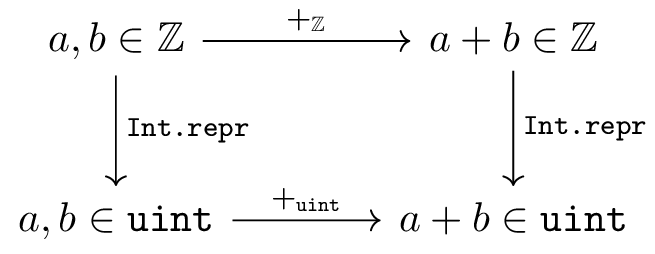

# Формальна верифікація для смертних

Коли запитуєш, як переконатися у тому, що програма працює як треба,
то можна почути багато відповідей на кшталт писати unit-тести,
наймати більше QA, використовувати статичні аналізатори
або просто молитися щоб все не зламалося в продакшені.
Але при цьому часто забувають, або взагалі не знають,
що існує формальна верифікація.
Що це таке?
Це коли існує математичний доказ того,
що програма працює правильно відповідно до формальної специфікації.
В ідеальному світі це має робити unit-тести та QA, ... непотрібними,
принаймні для тих частин системи, які формально верифіковані.
Чи це реально так круто, як здається?

Щоб зрозуміти це, варто спочатку подивитися на ієрархію методів верифікації.
В авіаційному стандарті DO-178C визначено рівні безпеки залежно від критичності коду:

| Рівень | Назва | Опис наслідків збою | Вимоги до верифікації |
|--------|-------|---------------------|----------------------|
| E | No Effect | Ніяк не впливає на безпеку літака | Тестування опціональне |
| D | Minor | Незначні незручності для екіпажу | Базові unit-тести<br>Code review |
| C | Major | Серйозні проблеми, але без загрози життю | 100% покриття коду<br>Інтеграційні тести<br>Manual QA |
| B | Hazardous | Можливі травми пасажирів або екіпажу | Статичний аналіз<br>Property-based testing<br>Фаззинг |
| A | Catastrophic | Загроза життю або катастрофа | **Формальна верифікація**<br>Математичний доказ коректності |

Можна бачити, що на вершині піраміди стоїть формальна верифікація, найвищий рівень безпеки коду, який можна досягти!
Чи варто використовувати її у ваших проєктах, вирішувати вам,
моя задача тільки пояснити як воно працює.

Є гарний ресурс Software Foundations, присвячений формальним методам верифікації програм.
Там є розділ 5, присвячений саме формальній верифікації C-коду.
Але там же й написано «перед читанням треба пропрацювати Volume 1
(та виконати всі вправи), потім Volume 2 (та виконати всі вправи)».
Звичайно що не кожен пан має час та натхнення це робити.
Та і сам текст це «відкрийте CoQ, виконайте команду,
вона працює так-то, а ця команда не працює».
Тому я вирішив просто взяти звідти перший приклад використання,
щось на кшталт Getting Started,
та переказати його зміст на рівні «взагалі по взагалям»,
не занурюючись у магію CoQ.
Вважайте це розважальним контентом.

Що ж таке формальна верифікація та що за звір цей CoQ?
CoQ це proof assistant, інструмент для перевірки математичних доказів.
Уявіть собі дуже прискіпливого редактора,
який перевіряє кожну кому вашої статті
і не пропустить жодної логічної помилки.
Тільки цей «редактор» — це комп'ютерна програма,
яка знає все про логіку та математику.
Формальна верифікація полягає у тому,
що ми записуємо вимоги у вигляді математичних тверджень,
а потім доводимо, що наш код відповідає цим вимогам.
Але годі слів, переходимо до прикладу.

```c
#include <stddef.h>

unsigned sumarray(unsigned a[], int n) {
  int i; unsigned s;
  i=0;
  s=0;
  while (i<n) {
    s+=a[i];
    i++;
  }
  return s;
}

unsigned four[4] = {1,2,3,4};

int main(void) {
  unsigned int s;
  s = sumarray(four,4);
  return (int)s;
}
```

Перед нами проста програма на мові програмування Сі.
Приблизно друга програма у житті, яку пишуть новачки,
відразу після розв'язання квадратного рівняння.
Функція знаходить суму елементів масиву.
Дуже простий приклад, як раз те, що треба на початку.
Але в цій функції є цикл, що для нас потім буде важливо.

Але чому саме обрана мова програмування Сі?
Головним чином через її простоту.
«Як так?» — запитають деякі!
Сі це дуже складна мова програмування!
Саме тому у новачків більшу популярність має Python!
Це так, складність буває різна.
Сі простий як лопата.
На Python простіше рити котлован для фундамента дому.
Але ніхто не скаже, що конструкція екскаватора простіше за лопату.

Звісно що аналогія це спрощення.
У світі програмування будь-яку лопату можна покращувати до нескінченості.
До речі, CPython написаний на мові програмування Сі.
Але мова йде більше про те, що з точки зору математики простота конструкції важливіше.
Саме тому алгоритмічна нерозв'язність доводиться на мові програмування BrainFuck
(машина Тьюринга), але спробуйте на ньому щось написати!
Тому для формальної верифікації простота мови Сі це благо, а не перешкода.

Як працює верифікація?
Зазвичай у нас є два світи.
Ідеальний платонічний світ математики, де просто будувати докази.
Та жорсткий брутальний світ програмування, де твій код падає зі страшною невизначеною поведінкою (UB, undefined behaviour).
І у нас, як завжди у фантастичних творах, є портали між світами.
Так, наприклад, типу `unsigned int`, який обмежений місткістю регістра процесора,
відповідає математичний необмежений тип цілих чисел ℤ,
який містить нескінченну кількість значень.
Перевести `unsigned int` в ℤ досить легко — беремо відповідне число.
А от назад... є варіанти, але за замовчуванням просто береться число по модулю.
Тоді сумі двох цілих чисел буде відповідати сума по модулю,
точнісінько як її виконує процесор.
Цей портал працює ідеально: ми можемо спочатку додати числа а потім перевести,
чи спочатку перевести, а потім скласти, результат це не змінить.
Математики люблять малювати комутативні діаграми, це самий простий приклад.



Тут намальовано два шляхи від лівого верхнього кута до правого нижнього.
Перший шлях: спочатку додаємо, потім беремо по модулю.
Другий шлях: спочатку беремо по модулю, потім додаємо.
А по законах жанру, якщо два шляхи приводять в одну точку, то результат однаковий.

Масиву буде відповідати список.
Типу `int`... буде відповідати той же самий тип ℤ.
Але цього разу побудувати таку красиву комутативну діаграму у нас не вийде.
Бо переповнення int відповідно до специфікації це UB.
Тому в функції `sumarray`, якщо уявити що параметр `a` має тип `int` замість `unsigned`,
то довести, що функція повертає суму елементів масиву можна буде лише у разі,
коли `n==0` або `n==1`.
Якщо `n>1`, то... нам треба буде додати два числа,
а це може бути переповнення, і все поламається.

З чого починається верифікація?
Оскільки всі докази у нас будуть в CoQ, то нам треба отримати AST
(Abstract Syntax Tree — абстрактне синтаксичне дерево нашої програми).
Це робиться за допомогою команди clightgen:

```bash
clightgen -normalize sumarray.c
```

Так, в моєму випадку вона матюкнеться

```
In file included from <built-in>:466:
<command line>:16:9: warning: redefining builtin macro [-Wbuiltin-macro-redefined]
   16 | #define __STDC_NO_THREADS__ 1
      |         ^
1 warning generated.
```

але все ж таки створить файл `sumarray.v`.
Це CoQ файл, який містить математичне представлення нашого коду.
Трохи зупинимося на описах статичної змінної `four` та функції `main`:

```coq
Definition v_four := {|
  gvar_info := (tarray tuint 4);
  gvar_init := (Init_int32 (Int.repr 1) :: Init_int32 (Int.repr 2) ::
                Init_int32 (Int.repr 3) :: Init_int32 (Int.repr 4) :: nil);
  gvar_readonly := false;
  gvar_volatile := false
|}.

Definition f_main := {|
  fn_return := tint;
  fn_callconv := cc_default;
  fn_params := nil;
  fn_vars := nil;
  fn_temps := ((_s, tuint) :: (_t'1, tuint) :: nil);
  fn_body :=
(Ssequence
  (Ssequence
    (Ssequence
      (Scall (Some _t'1)
        (Evar _sumarray (Tfunction (Tcons (tptr tuint) (Tcons tint Tnil))
                          tuint cc_default))
        ((Evar _four (tarray tuint 4)) :: (Econst_int (Int.repr 4) tint) ::
         nil))
      (Sset _s (Etempvar _t'1 tuint)))
    (Sreturn (Some (Ecast (Etempvar _s tuint) tint))))
  (Sreturn (Some (Econst_int (Int.repr 0) tint))))
|}.
```

Префікси `v_` та `f_` позначають змінні та функції відповідно.
Видно LISP-подібне AST з функціями на кшталт `Ssequence`, `Scall`, `Sreturn`.
Купа атрибутів як `gvar_readonly`, `fn_callconv` береться безпосередньо з коду та стандарту C.

В принципі це так, для загальної інформації, звідки CoQ про це знає.
Збілдити цей файл можна командою

```
coqc -Q . VC sumarray.v
```

Тут `-Q . VC` означає, що поточна директорія буде доступна як простір імен `VC` в CoQ.
В результаті буде згенеровано багато файлів sumarray з різними розширеннями,
що дозволить нам потім імпортувати цей файл за допомогою команди `Require Import VC.sumarray.`

Далі в наших планах створити файл `Verif_sumarray.v` в якому будуть міститися специфікації та докази коректності.
Там ми побудуємо математичну функцію `sum_Z`, яка буде знаходити суму елементів списку цілих чисел,
та доведемо, що вона еквівалентна нашій C функції `sumarray`.

Тут відразу виникає перше запитання.
Так, припустимо ми довели що функції еквівалентні.
Але що буде, якщо ми припустилися помилок в двох реалізаціях?
Так, це гарне запитання, ми можемо помилитися у формальній специфікації.
Але в математичному світі ми зможемо довести більше фактів про `sum_Z`.
Наприклад, що виклик функції `sum_Z` для списку з одного елементу поверне цей елемент.
Або що виклик `sum_Z` для конкатенації списків дорівнює сумі викликів `sum_Z` для кожного списку окремо.

В наступному фрагменті коду є визначення функції `sum_Z` через операцію згортання
(fold), а також докази цих фактів:

```coq
Definition sum_Z : list Z -> Z := fold_right Z.add 0.

Lemma sum_Z_one_elem : forall x, sum_Z [x] = x.
Proof.
  intro. simpl. lia.
Qed.

Lemma sum_Z_app:
  forall a b, sum_Z (a++b) =  sum_Z a + sum_Z b.
Proof.
  intros. induction a; simpl; lia.
Qed.
```

Тепер ці факти формально доведено (можете не звертати уваги на магію CoQ).
І тепер у нас не дуже багато варіантів помилитися таким чином,
щоб функція `sum_Z` задовільняла цим умовам, та при цьому робила щось відмінне від суми.
Але факт є фактом, помилка у специфікації може звести на нівець усі наші зусилля.
Втішає лише факт, що помилитися у специфікації складніше,
а ще й так, щоб ця помилка точно відповідала помилці в коді,
то це або диверсія, або нереальний збіг обставин.

Тепер ми готові дати формальну специфікацію функції `sumarray`,
яка буде виглядати наступним чином:

```coq
Definition sumarray_spec : ident * funspec :=
DECLARE _sumarray
 WITH a: val, sh : share, contents : list Z, size: Z
 PRE [ tptr tuint, tint ]
  PROP  (readable_share sh; 0 <= size <= Int.max_signed;
         Forall (fun x => 0 <= x <= Int.max_unsigned) contents)
  PARAMS (a; Vint (Int.repr size))
  SEP   (data_at sh (tarray tuint size) (map Vint (map Int.repr contents)) a)
 POST [ tuint ]
  PROP () RETURN (Vint (Int.repr (sum_Z contents)))
  SEP (data_at sh (tarray tuint size) (map Vint (map Int.repr contents)) a).
```

Виглядає моторошно...
Але, якщо пропустити магію CoQ, то тут у секції `WITH` можна побачити сутності ідеального математичного світу,
які будуть відповідати змінним `sumarray`:
`a` це показчик на масив,
`contents` це сам масив, вміст пам'яті з адресу `a` довжиною `n * sizeof(unsigned)` байт,
`size` це змінна `n`,
а `sh`... забийте, це права доступу до пам'яті, на яку посилається `a`.

Наступна секція `PRE`.
Вона містить умови, які накладаються на аргументи функції, щоб виклик пройшов коректно.
Якщо їх перекласти людською мовою, то:
* `readable_share sh` — пам'ять, на яку посилається `a` має бути доступною для читання,
* `0 <= size <= Int.max_signed` — розмір масиву не може бути від'ємним,
* `Forall (fun x => 0 <= x <= Int.max_unsigned) contents` — жодних обмежень на елементи масиву `a`.

Наступна секція `POST`.
Вона містить твердження, які автоматично будуть виконані після завершення функції.
Звісно, при умові що у момент виклику були виконані всі умови `PRE`.
Якщо їх перекласти людською мовою, то:
* `RETURN (Vint (Int.repr (sum_Z contents)))` — функція поверне значення `sum_Z contents`, суму всіх елементів масиву,
* `SEP (data_at sh (tarray tuint size) (map Vint (map Int.repr contents)) a)` — масив залишиться незмінним після виконання функції.

В принципі, умови виглядають досить логічно, нам лишилося лише довести це.
От як це робиться:

```coq
Lemma body_sumarray: semax_body Vprog Gprog f_sumarray sumarray_spec.
Proof.
  start_function.
  forward. (* i = 0; *)
  forward. (* s = 0; *)
  forward_while
   (EX i: Z,
     PROP  (0 <= i <= size)
     LOCAL (temp _a a;
            temp _i (Vint (Int.repr i));
            temp _n (Vint (Int.repr size));
            temp _s (Vint (Int.repr (sum_Z (sublist 0 i contents)))))
     SEP   (data_at sh (tarray tuint size) (map Vint (map Int.repr contents)) a)).

  - (* Check invariant before *)
    Exists 0. entailer!.

  - (* i<n *)
    entailer!.

  - (* loop body *)
    assert_PROP (Zlength contents = size). {
      entailer!.
      do 2 rewrite Zlength_map. reflexivity.
    }
    forward. (* t' = a[i] *)
    forward. (* s = s + t' *)
    forward. (* i = i + 1 *)
    Exists (i+1).
    entailer!. f_equal. f_equal.
    rewrite (sublist_split 0 i (i+1)) by lia.
    rewrite sum_Z_app. rewrite (sublist_one i) by lia.
    simpl. lia.

  - (* Continue execution after loop *)
    forward.  (* return s; *)
    entailer!.
    autorewrite with sublist in *|-.
    autorewrite with sublist.
    reflexivity.
Qed.
```

Ознайомимося трохи зі структурою доказу.
Це дуже нагадує відлагодження.
Тільки, коли ми виконуємо команду `next` в `gdb` (або вибираємо Debug -> Step в меню IDE),
то ми виконуємо команду при конкретних значеннях змінних.
А коли ми виконуємо тактику `forward`, то ми переходимо на наступну команду
для всіх можливих значень змінних.
Коли ми виконаємо `forward` на операторі `i=0`, то в нашу базу фактів буде додано факт, що `i==0`.
Те ж саме з `s`.
Також не складно за допомогою `forward` виконати `if` (треба буде послідовно пройтися по гілках).
Але складнощі починаються з циклом: ми не можемо його пройти послідовно,
бо в різних викликах функції може бути різна кількість ітерацій.

Але вихід є!
Він називається «інваріант циклу».
Це таке твердження, яке залишається істинним після кожної ітерації.
Погана новина полягає у тому, що ніхто не допоможе з тим, який інваріант циклу буде корисним.
В даному разі інваріант доволі очевидний і складається з двох тверджень:
(1) `0 <= i <= size` — лічильник знаходиться в межах масиву,
(2) сума чисел від 0 до `i` в масиві `a` дорівнює `s`.
Або мовою CoQ: `PROP (0 <= i <= size)` та `temp _s (Vint (Int.repr (sum_Z (sublist 0 i contents))))`.
Там `sum_Z (sublist 0 i contents)` це і є наш функціональний виклик функції sum_Z, перед яким йде трохи магії.

Тепер нам треба довести, що (1) інваріант виконується на початку циклу;
(2) умова циклу виконується без UB;
(3) інваріант циклу зберігається при виконанні циклу з додатковою умовою `i<n` що ми не вийшли з циклу — тут треба пройти цикл один раз в нашому «відлагоджувачі».
І все, можна буде додати до списку фактів інваріант та умову виходу з циклу, та продовжити доказ.
В термінології CoQ це означає, що нам треба довести чотири цілі: (1)-(3) та ціль (4) продовження після циклу.
Початок доказу кожної нової цілі починається з символу мінус `-`.

Перша ціль: інваріант виконується на початку.
Доказ тривіальний, бо ми вже знаємо що `i==0` та `s==0`, а сума нуля елементів це нуль.
Тільки трохи магії, яка синхронізує світи.

Друга ціль: умова циклу виконується без UB.
Теж тривіальна — порівняння двох `int` визначено для будь-яких значень.
`entailer!.` тут означає спростити усе що тільки можливо, після чого результат буде очевидний.

Третя ціль: інваріант зберігається.
Тут ми виконуємо покроково тіло циклу.
Зверніть увагу, що два оператори `s+=a[i]; i++;` замінилися трьома діями: `t'=a[i]; s=s+t'; i=i+1;`
І потім знову трохи магії — доводимо що сума елементів від 0 до i+1
дорівнює сумі елементів від 0 до i плюс елемент з індексом i.
Для цього ми використовуємо лему `sum_Z_app` яку доводили на початку.

Тепер остання ціль, виконуємо `return s;` через `forward`
після чого з трьох фактів: `i >= n` (умова виходу з циклу),
`0 <= i <= size` (з інваріанту) та `size = n` (з умов PRE)
робимо висновок, що `i = n`, отже s дорівнює сумі всіх елементів масиву.

Поздоровляю, ми верифікували нашу першу функцію!

Зробимо невеличкий огляд.
Доказ, в принципі, був досить прямолінійний.
Єдина проблема була знайти інваріант.
І то для даного прикладу він був досить очевидним,
але в інших більш практичних випадках це може бути справжнім викликом.

Візьмемо у якості більш неочевидного прикладу відому задачу реверсу списку:

```c
struct node* reverse(struct node* list) {
    struct node* result = NULL;
    struct node* remaining = list;

    while (remaining != NULL) {
        struct node* current = remaining;
        remaining = remaining->next;
        current->next = result;
        result = current;
    }

    return result;
}
```

То тут інваріантом буде `reverse(result) ++ remaining == list`.
По виходу з циклу `remaining` буде пустим, тому отримаємо `reverse(result) == list`.
Бачимо, що формула досить неочевидна, і автоматично не може бути отримана, знаходити інваріант це творча робота розробника.

Тут цікаво провести паралелі з іншим методом верифікації, який реалізований у SPARK (Ada).
Подивимося на приклад

```ada
with Loop_Types; use Loop_Types;

procedure Zero_Arr (A : out Arr_T) with
    SPARK_Mode,
    Post => (for all J in A'Range => A(J) = 0)
is
begin
   for J in A'Range loop
      A(J) := 0;
      pragma Loop_Invariant (for all K in A'First .. J => A(K) = 0);
   end loop;
end Zero_Arr;
```

Тут ми бачимо верифіковане обнулення масиву.
Виглядає трохи людяніше: pre та post умови та інваріант циклу ми бачимо в коді,
а не в окремому файлу.
Принцип аналогічний: ми пишемо інваріант циклу,
а далі вже сам SPARK пробує різні кроки для того, щоб довести післяумову.
Єдина відмінність полягає у тому, що якщо інваріанти не допомогли, то нічого вдіяти не можна.
А у разі CoQ ми можемо (насправді мусимо) довести будь-яку лему вручну, якщо її взагалі можна математично довести.
Ну і якщо вистачить скілу та терпіння.

Таким чином, що нам дає CoQ?
По-перше, там формально описана семантика мови програмування Сі.
Оскільки Сі проста як лопата, то це задача хоча й складна, але, як бачимо, підйомна.
Про інші мови тут думати не хочу.
По-друге, там реалізовані різні тактики, які дозволяють нам ходити по дереву AST,
та виконують трохи бойлерплейту, хоча хотілося би більше.

Можливо комусь це може здатися дитячою забавкою.
Дійсно, довели елементарщину!
Але починати треба з елементарщини.
Якщо когось зацікавлять більш серйозні речі, то пропоную подивитися на
[каталог всіх прикладів VST](https://github.com/PrincetonUniversity/VST/blob/master/doc/catalog-of-examples.md).
Там є верифікація збирача сміття з поколіннями (generational garbage collector) для програм з графами,
паралельна система повідомлень (concurrent messaging system) та багато іншого.

Ну все, я думаю що вас достатньо розважив.
Тепер ви маєте мати трохи кращу уяву про верифікацію.
Кому цікаво йти далі, то даю посилання:

[Software Foundations](https://softwarefoundations.cis.upenn.edu/) — фундаментальний курс з формальних методів та верифікації програм.
Складається з кількох томів, від основ логіки до практичних застосувань.
Volume 5: Verifiable C присвячений саме VST та містить набагато більше прикладів і деталей, ніж у нашій статті.
Там також можна знайти, як доводити операції зі списками, слідкувати за malloc/free — те, що Ada+SPARK робить погано.

[Офіційний підручник VST](https://vst.cs.princeton.edu/download/VC.pdf) з детальними поясненнями та прикладами.

[I can't believe that I can prove that it can sort](https://blog.adacore.com/i-cant-believe-that-i-can-prove-that-it-can-sort) — стаття AdaCore про верифікацію алгоритмів сортування на SPARK.

Приклади можна знайти на [github](https://github.com/mustitz/blabber/blob/master/vst/).
